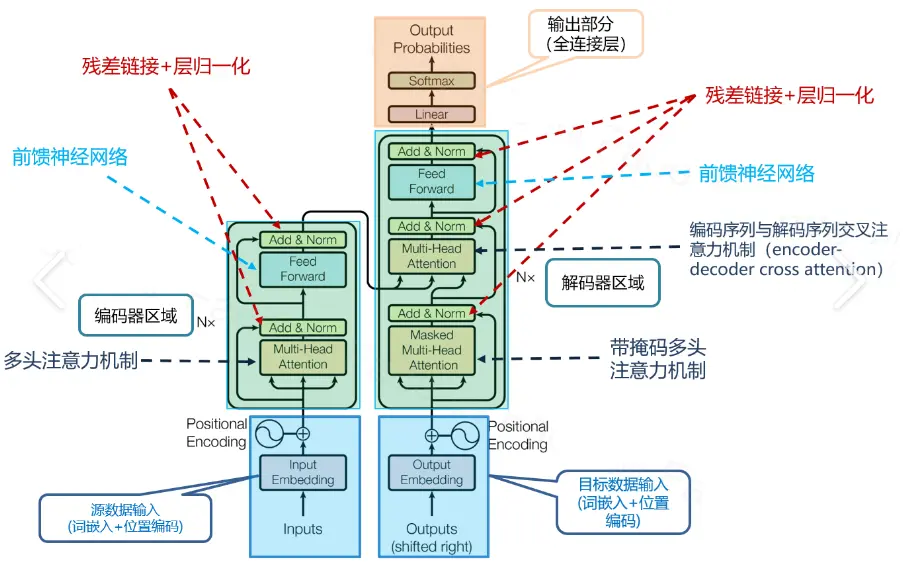

## 简述Transfomer的嵌入层（Embedding Layer）
嵌入层作为transformer的输入层，主要是将输入的 Token 转换为连续的向量表示，主要包括词嵌入和位置编码两个部分。
### 1.词嵌入（Word Embedding）
词嵌入是将输入序列中的每个token映射到一个高维嵌入向量。这些向量能够捕捉到词与词之间的语义关系。

词嵌入的过程是：（1）初始化一个嵌入矩阵，其行数等于词汇表大小V，列数为嵌入维度d；（2）通过词汇表得到输入文本中每个token对应的索引；（3）以索引为行数，直接从嵌入矩阵里取出对应的那一行向量，这行向量就成了该 token的嵌入向量。

### 2.位置编码（Positional Encoding）
由于 Transformer 是基于自注意力机制的，它没有内建的顺序信息。为了解决这个问题，Transformer 添加了位置编码（Positional Encoding），使模型能够感知输入序列中各个单词的顺序。位置编码是与词嵌入相加的，它的作用是为每个词的嵌入向量添加一个唯一的位置信息。

位置编码有几种不同的形式，最常见的是使用正弦和余弦函数计算得到的编码，其维度与词嵌入向量的维度相同。这样，输入的每个标记就不仅仅是它的词嵌入向量，还包括它在序列中的位置。

位置编码的计算公式如下：
$$
PE_{(pos, 2i)} = \sin(pos / 10000^{2i/d})
$$
$$
PE_{(pos, 2i+1)} = \cos(pos / 10000^{2i/d})
$$

其中，`pos` 是位置，`i` 是维度，`d` 是嵌入维度。

### 3.嵌入层的输出
最终的嵌入层输出是词嵌入和位置编码的和，即：
$$
E_{input} = {Embedding}(x) + PE
$$
最后词向量不仅能够捕捉词语间的语义关系，还能够体现词序列中的顺序信息。

## 比较attention和self-attention (★)
### 1.attention
Attention指广义上的注意力机制，关注目标序列和源序列之间的关系。Attention机制发生在Target的元素Query和Source中的所有元素之间。其本质可以被描述为一个查询（query）到一系列 键（key）- 值（value）对 的映射。

Attention机制的具体计算过程可以分为三个阶段：第一个阶段是根据Query和Key计算两者的相似性或者相关性；第二个阶段对第一阶段的原始分值进行归一化处理，得到权重系数。第三个阶段根据权重系数对Value进行加权求和。

在计算attention时主要分为三步：

第一步是将query和每个key进行相似度计算得到权重，常用的相似度函数有点积，拼接，感知机等；

第二步一般是使用softmax函数对这些权重进行归一化；

第三步将权重和相应的value进行加权求和得到最后的attention。
### 2.self-attention
Self-Attention（自注意力）用于捕获同一个序列不同位置之间的关系，对输入的每个位置计算该位置与所有其他位置的相关性。它的计算公式和attenion一样。

### 3.联系  
**本质相同**：
   - Attention和Self-Attention都基于相同的核心思想：通过计算注意力权重分配不同的重要性，从输入数据中提取关键信息。
   - 它们的核心公式基本一致，都使用 ${Attention}(Q, K, V) = {Softmax}(\frac{QK^T}{\sqrt{d_k}})V$。

**组成结构**：
   - 两者都依赖 `Query`、`Key` 和 `Value` 三个基本向量进行注意力权重的计算。
   - 都会计算相似性（点积、加权求和）来得到加权输出。

**实现原理一致**：
   - Attention和Self-Attention都可被理解为一种全局信息的动态提取方式，关注输入序列中的不同位置或片段。

---

### 4.区别

| **维度**     | **Attention**                                                   | **Self-Attention**                                                          |
| ------------ | --------------------------------------------------------------- | --------------------------------------------------------------------------- |
| **定义**     | Attention指广义上的注意力机制，关注目标序列和源序列之间的关系。 | Self-Attention是一种特定的Attention机制，关注同一序列中不同位置之间的关系。 |
| **输入来源** | Query、Key、Value可以来自**不同序列**。                         | Query、Key、Value都来自**同一序列**。                                       |
| **应用场景** | 常用于**跨序列交互**，如机器翻译中目标句与源句之间的注意力。    | 常用于**同序列内部交互**，如句子中单词之间的依赖建模。                      |
| **复杂度**   | 计算复杂度由两序列的长度共同决定。                              | 计算复杂度仅由单序列长度决定（$O(n^2)$）。                                  |
| **输出含义** | 输出是对源序列中最相关信息的提取。                              | 输出是对当前序列中上下文依赖关系的建模。                                    |

## 多头自注意力（Multi-Head Attention）

为了让模型能够关注输入序列的不同子空间（不同类型的关系），Transformer引入了**多头自注意力机制**。它的基本思想是，模型可以通过多个独立的“头”来计算自注意力，每个头都有一组独立的查询、键和值的权重矩阵。计算完成后，将这些头的输出进行拼接（concatenate），再通过线性变换得到最终的结果。
$$
{Multi-Head Attention}(Q, K, V) = {Concat}({head}_1, {head}_2, \dots, {head}_h) W_O
$$

每个头都学习不同的注意力模式，从而使得模型能够捕捉到更多的上下文信息和不同层次的依赖关系。
## FFN 的线性矩阵初始化
在 Transformer 模型中，前馈神经网络（FFN）部分通常是由两层线性变换和一个激活函数（如 ReLU 或 GELU）组成。其权重矩阵的初始化对模型的收敛和性能有很大影响。

### 1. FFN 结构
假设输入维度为 $d_{model}$，FFN 的结构通常是：

1. 第一层的线性变换将维度从 $ d_{model} $映射到一个较大的维度 $d_{ffn}$。
2. 激活函数（通常是ReLU或GELU）在第一层和第二层之间。
3. 第二层的线性变换将维度从$d_{ffn}$映射回 $d_{model}$。

公式表示为：
$$
{FFN}(x) = {max}(0, xW_1 + b_1)W_2 + b_2
$$
其中：
- $ W_1 $和 $ W_2 $是两个线性变换的权重矩阵。
- $ b_1 $和 $ b_2 $ 是偏置项。

### 2. 权重矩阵的初始化
权重矩阵$ W_1 $和 $ W_2 $的初始化需要满足以下要求：
1. **避免梯度爆炸或消失**：权重应在初始时让输入和输出的方差保持一致。
2. **促进训练收敛**：合理的初始化能加速模型训练。

常用的初始化方法包括：

#### (1) **Xavier Initialization (Glorot Uniform/Normal)**

适用场景：
- 激活函数是对称的（如 tanh 或 sigmoid）。
$$
  W \sim \mathcal{U}(-\sqrt{\frac{6}{n_{in} + n_{out}}}, \sqrt{\frac{6}{n_{in} + n_{out}}})
$$
  或
$$
  W \sim \mathcal{N}(0, \frac{2}{n_{in} + n_{out}})
$$
  - $n_{in} = d_{model}$：输入维度
  - $n_{out} = d_{ffn}$：输出维度

#### (2) **Kaiming Initialization (He Uniform/Normal)**

适用场景：
- 激活函数是 ReLU 或类似函数（如 Leaky ReLU、GELU）。
$$
  W \sim \mathcal{N}(0, \frac{2}{n_{in}})
$$
  或
$$
  W \sim \mathcal{U}(-\sqrt{\frac{6}{n_{in}}}, \sqrt{\frac{6}{n_{in}}})
$$
  - $n_{in} = d_{model}$：输入维度

#### (3) **Transformer 默认初始化（PyTorch 实现）**

- PyTorch 中的 `torch.nn.Linear` 默认使用 **Kaiming Uniform** 初始化：
$$
  W \sim \mathcal{U}(-\sqrt{\frac{1}{n_{in}}}, \sqrt{\frac{1}{n_{in}}})
$$

### 3. **偏置的初始化**
- 通常初始化为零：
$$
  \mathbf{b} = \mathbf{0}
$$
- 有时使用小的正值（如 $10^{-3}$），以避免激活函数陷入饱和区。

## Transformer 模型的默认初始化
在 PyTorch 中，Transformer 模型的默认初始化主要由以下几个组件决定。以 `torch.nn.Transformer` 模块为例，以下是其默认初始化的关键细节：

### 1. **各个组件的权重初始化**
Transformer 中的线性层、嵌入层和层归一化（LayerNorm）等模块均会在初始化时采用 PyTorch 的默认初始化策略。

- **嵌入层（`torch.nn.Embedding`）**
  - 权重：通常使用 $\mathcal{U}(-\sqrt{k}, \sqrt{k})$初始化，其中 $k = \frac{1}{\text{embedding\_dim}}$。
  
- **线性层（`torch.nn.Linear`）**
  - 权重：使用均匀分布初始化，范围为 $[- \sqrt{\frac{1}{fan\_in}}, \sqrt{\frac{1}{\text{fan\_in}}}]$，其中 `fan_in` 是输入的特征数量。
  - 偏置：初始化为 0。
  
- **多头注意力（`torch.nn.MultiheadAttention`）**
  - Query、Key、Value 的权重：与线性层初始化相同。
  - 偏置：初始化为 0。

### 2. **LayerNorm 初始化**
- 权重：初始化为全 1。
- 偏置：初始化为全 0。

### 3. **Transformer 的模块默认初始化**
`torch.nn.Transformer` 模块内部包含多层编码器（`Encoder`）和解码器（`Decoder`），其默认初始化方式与上述组件一致。

- **Encoder 层的子模块**
  - 多头注意力层：遵循 `torch.nn.MultiheadAttention` 的初始化规则。
  - 前馈网络：由两个 `torch.nn.Linear` 层组成，均使用线性层的默认初始化规则。
  - LayerNorm：权重为 1，偏置为 0。

- **Decoder 层的子模块**
  - 与编码器层相同，但包含额外的跨注意力层，其初始化方式与多头注意力一致。

