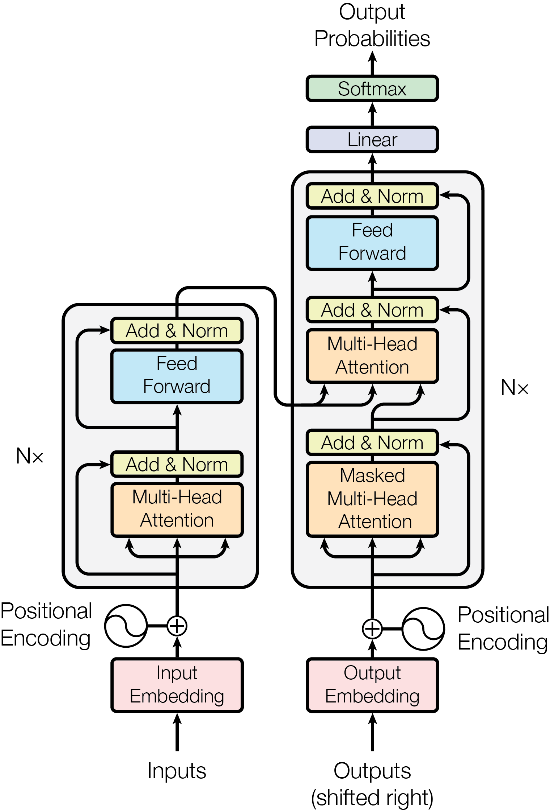

# 一、嵌入层
## 简述Transfomer的嵌入层（Embedding Layer）
嵌入层作为transformer的输入层，主要是将输入的 Token 转换为连续的向量表示，主要包括词嵌入和位置编码两个部分。
### 1.词嵌入（Word Embedding）
词嵌入是将输入序列中的每个token映射到一个高维嵌入向量。这些向量能够捕捉到词与词之间的语义关系。

词嵌入的过程是：（1）初始化一个嵌入矩阵，其行数等于词汇表大小V，列数为嵌入维度d；（2）通过词汇表得到输入文本中每个token对应的索引；（3）以索引为行数，直接从嵌入矩阵里取出对应的那一行向量，这行向量就成了该 token的嵌入向量。

### 2.位置编码（Positional Encoding）
由于 Transformer 是基于自注意力机制的，它没有内建的顺序信息。为了解决这个问题，Transformer 添加了位置编码（Positional Encoding），使模型能够感知输入序列中各个单词的顺序。位置编码是与词嵌入相加的，它的作用是为每个词的嵌入向量添加一个唯一的位置信息。

位置编码有几种不同的形式，最常见的是使用正弦和余弦函数计算得到的编码，其维度与词嵌入向量的维度相同。这样，输入的每个标记就不仅仅是它的词嵌入向量，还包括它在序列中的位置。

位置编码的计算公式如下：
$
PE_{(pos, 2i)} = \sin(pos / 10000^{2i/d})
$
$
PE_{(pos, 2i+1)} = \cos(pos / 10000^{2i/d})
$

其中，`pos` 是位置，`i` 是维度，`d` 是嵌入维度。

### 3. **嵌入层的输出**
最终的嵌入层输出是词嵌入和位置编码的和，即：
$
E_{\text{input}} = \text{Embedding}(x) + PE
$

最后词向量不仅能够捕捉词语间的语义关系，还能够体现词序列中的顺序信息。
