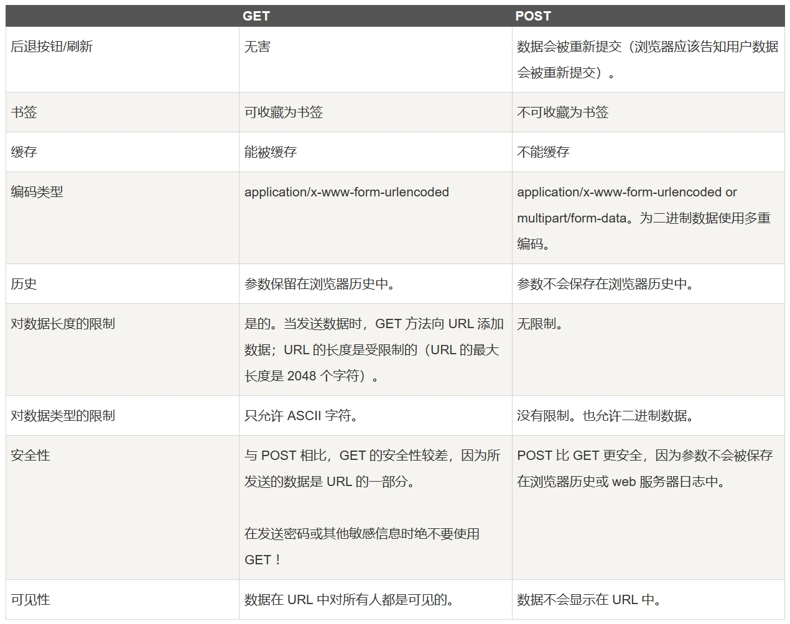
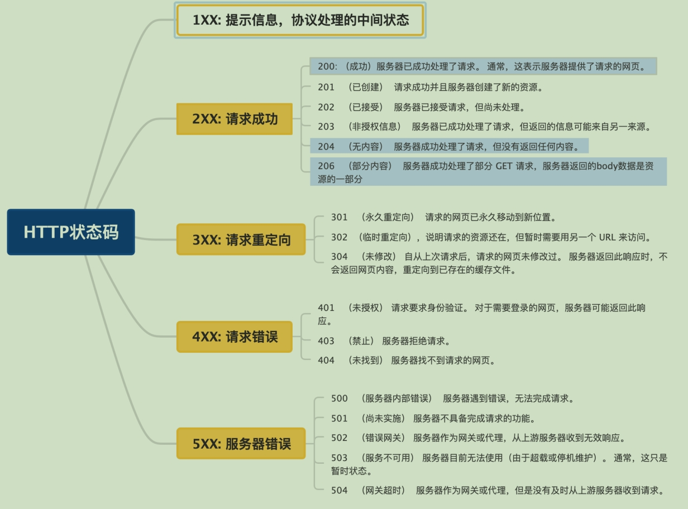

# 第1章 计算机网络体系结构
# 第2章 物理层
# 第3章 数据链路层
# 第4章 网络层
## NAT 的作用是什么？
NAT（Network Address Translation，网络地址转换） 主要用于在不同网络之间转换 IP 地址。它允许将私有 IP 地址（如在局域网中使用的 IP 地址）映射为公有 IP 地址（在互联网中使用的 IP 地址）或者反向映射，从而实现局域网内的多个设备通过单一公有 IP 地址访问互联网。

NAT 不光可以缓解 IPv4 地址资源短缺的问题，还可以隐藏内部网络的实际拓扑结构，使得外部网络无法直接访问内部网络中的设备，从而提高了内部网络的安全性。

## 地址解析协议（ARP）
### 定义
完成IP地址到MAC地址的映射（根据IP地址查MAC地址）的协议，就是地址解析协议（ARP）。每台主机都设有一个ARP高速缓存，用来存放本局域网上各主机和路由器的IP地址到MAC地址的映射表，称ARP表。使用ARP来动态维护此ARP表。
### 工作原理
1. 主机A欲向本局域网上的某台主机B发送IP数据报时，先在其ARP高速缓存中查看有无主机B的IP地址。
2. 如有，就可查出其对应的硬件地址，再将此硬件地址写入MAC帧，然后通过局域网将该MAC帧发往此硬件地址。
3. 如果没有，那么就通过使用目的MAC地址为FF-FF-FF-FF-FF-FF的帧来封装并广播ARP请求分组，使同一个局域网里的所有主机收到ARP请求。
4. 主机B收到该ARP请求后，向主机A单播一个响应ARP分组。分组中包含主机B的IP与MAC地址的映射关系，主机A在收到后将此映射写入ARP缓存，然后按查询到的硬件地址发送MAC帧。
  
# 第5章 传输层
## UDP 和 TCP 的区别
1. 连接方式：UDP 在传送数据之前不需要先建立连接。而 TCP 提供面向连接的服务，传输前需通过三次握手建立连接，结束后通过四次挥手断开连接。
2. 可靠性：UDP 不保证数据传输的可靠性，数据发送出去后，不需要给出任何确认，也不会进行重传等操作，可能会出现数据丢失、乱序等情况。TCP 提供可靠的传输服务，通过序列号、确认应答、重传机制等保证数据的准确无误和按序到达。如果数据在传输过程中丢失或损坏，TCP 会自动重传，确保接收方能够完整地收到数据。
3. 传输效率：由于使用 TCP 进行传输的时候比 UDP 多了连接、确认、重传等机制，所以 TCP 的传输效率要比 UDP 低很多。
4. 传输形式：UDP 是面向报文的，每个数据报都是独立的，有明确的边界和长度，接收方每次接收的就是一个完整的数据报。TCP 是面向字节流的，它将应用层传来的数据看作是无结构的字节流，TCP会根据网络状况和接收方的缓冲区大小，将字节流分割成合适大小的报文段进行传输。接收方在收到这些报文段后，会将它们重新组合成完整的字节流交付给应用层。
5. 首部开销：UDP的首部长度固定为 8 字节，只包含源端口、目的端口、长度和校验和四个字段，开销较小。TCP的首部长度一般为 20 - 60 字节，首部包含了源端口、目的端口、序列号、确认号、窗口大小等众多字段，用于实现各种控制和管理功能。
6. 流量和拥塞控制：UDP无流量和拥塞控制，可能因大量发送导致网络拥塞。TCP的流量控制机制通过滑动窗口机制动态调整发送速率，避免接收方缓冲区溢出。拥塞控制机制通过慢启动、拥塞避免、快速重传等算法避免网络过载。
7. 适用场景：UDP适用于对实时性要求高、能容忍一定数据丢失的场景，如实时通信和在线游戏等。TCP适用于对数据准确性要求高、不允许丢失或出错的场景，如文件传输、电子邮件、网页浏览等。

---
## TCP三次握手流程
1. ​第一次握手（客户端→服务器）​：
客户端发送SYN=1（同步标志）和初始序列号seq=X，表示请求建立连接。

2. ​第二次握手（服务器→客户端）​：
服务器返回SYN=1（同步标志）和ACK=1（确认标志），同时携带自己的初始序列号seq=Y，以及对客户端序列号的确认号ack=X+1。

3. ​第三次握手（客户端→服务器）​：
客户端发送ACK=1，确认服务器的序列号ack=Y+1，连接正式建立。

## 为什么TCP连接的时候是三次握手，关闭的时候却是四次握手？⭐⭐

### 连接时三次握手的原因
**三次握手的本质**：通过两次 `SYN` 交换，确保双方序列号同步，并验证双向通信能力。
#### 1. 同步初始序列号
在TCP通信中，每个字节的数据都有一个唯一的序列号，用于保证数据的有序性和可靠性。客户端和服务器需要在连接建立时同步彼此的初始序列号（ISN）。通过三次握手，客户端发送包含自己初始序列号的SYN包给服务器，服务器收到后返回包含自己初始序列号的SYN + ACK包给客户端，客户端再发送ACK包确认收到服务器的序列号，这样双方就完成了初始序列号的同步，保证后续数据传输基于一致的起点。

#### 2. 验证双方的发送和接收能力（验证双向通信能力）
- 第一次握手客户端向服务器发送SYN包，表明客户端具有发送数据的能力。
- 第二次握手服务器收到SYN包后，返回SYN + ACK包，这意味着服务器能够接收到客户端发送的数据，并且具有发送数据的能力。
- 第三次握手客户端收到服务器的SYN + ACK包后，再发送ACK包进行确认，进一步验证了客户端能够接收服务器的数据。经过三次握手，双方都确认了彼此的发送和接收能力，从而保证了后续数据传输的可靠性。

#### 3. 三次握手是保证连接建立的最少次数
两次握手无法确保双方都确认对方的发送和接收能力。两次握手的风险：服务端在发送SYN-ACK后即认为连接建立，但客户端可能未收到响应，导致服务端资源浪费（如维护无效连接）。三次握手已能确保双向通信可靠，增加次数会降低效率且无必要。

### 关闭时四次挥手的原因
#### 1. TCP的半关闭特性
TCP提供了半关闭的机制，即允许一方在发送完数据后停止发送，但仍然可以继续接收对方发送的数据。这意味着客户端和服务器关闭连接的过程不是同时进行的，一方可以先关闭自己的发送通道，而另一方仍然可以继续发送数据。

#### 2. 信息交互的独立性
- 客户端发送FIN包，表示请求关闭自己的发送通道，但此时客户端仍然可以接收服务器发送的数据。
- 服务器收到FIN包后，返回ACK包进行确认，表示已经收到客户端的关闭请求。此时服务器的发送通道仍然是打开的，服务器可以继续向客户端发送数据。
- 当服务器也准备关闭连接时，会发送FIN包给客户端，表示请求关闭自己的发送通道。
- 客户端收到服务器的FIN包后，返回ACK包进行确认，表示已经收到服务器的关闭请求。至此，双方的连接才完全关闭。

由于TCP的半关闭特性，使得服务器在收到客户端的FIN包后，不能立即同时发送FIN和ACK，而是需要分两步进行，因此关闭连接时需要四次挥手。

综上所述，连接时的三次握手是为了高效、可靠地建立连接，而关闭时的四次挥手是为了适应TCP的半关闭特性，确保双方能够独立地关闭自己的发送通道，保证数据的完整性和连接的正确关闭。 

---
## TCP 第 2 次握手传回了 ACK ，为什么还要传回 SYN ？
1. **双向同步序列号**  
   - **第一次握手**：客户端发送 `SYN`（同步序列号 `seq=x`），表示请求建立连接。  
   - **第二次握手**：服务器需要：  
     - **确认客户端的 `SYN`** → 返回 `ACK=x+1`（表示已收到客户端的 `seq=x`）。  
     - **同步自己的序列号** → 发送 `SYN`（携带自己的初始序列号 `seq=y`）。  
   - **第三次握手**：客户端返回 `ACK=y+1`，确认服务器的 `seq=y`。  

如果第二次握手只传 ACK ，不传 SYN ，则服务器的序列号无法被初始化。只有通过两次 `SYN` 交换，双方才能协商出各自的初始序列号，确保后续数据传输的可靠性。
2. **确保双方通信能力**
第二次握手的 ACK 表明服务器已正确接收客户端的数据，SYN 则表明服务器有能力发送数据。如果只传ACK，不传SYN，客户端缺少服务器序列号同步，无法确认服务器的发送能力。同时服务器的序列号未初始化，无法启动自己的数据发送流程。那么就只能实现客户端向服务器单向的连接建立，无法完成服务器向客户端方向的连接初始化，也就无法实现全双工通信。

---
## 为什么不能把服务器发送的 ACK 和 FIN 合并起来，变成三次挥手？
1. TCP是全双工协议，需独立关闭双向通道
TCP允许双方独立关闭各自的发送通道。客户端发送FIN仅表示客户端到服务器的方向关闭​（客户端不再发送数据），但服务器到客户端的方向仍可能传输数据。服务器的ACK仅确认收到客户端的FIN，确保关闭客户端的发送通道；而服务器的FIN需要等待自身数据发送完毕后再发出，关闭服务端的发送通道。这是两个不同的操作，分别对应着不同方向上的连接状态变化，可能存在时间差，不能简单地合并。
2. 服务器可能仍有数据需要发送
当服务器收到客户端的FIN时，可能仍有未传完的数据。此时需先发送ACK确认客户端的关闭请求，继续发送数据，最后再发送自己的FIN关闭连接。​若合并ACK和FIN，会导致服务器无法在确认后继续发送数据，可能丢失部分响应。
3. 协议设计的通用性
TCP需覆盖所有场景，包括服务器需要延迟关闭的情况（如长连接、文件传输）。合并ACK和FIN仅适用于服务器立即关闭的特定场景，但协议需保证普适性。

---

## TCP四次挥手流程详解

#### 1. 第一次挥手（主动关闭方 → 被动关闭方）
- **操作**：主动关闭方（如客户端）发送 `FIN` 报文（设序列号为 `seq = u`），并进入 **`FIN_WAIT_1`** 状态。  
- **含义**：表示主动方不再发送数据，但可继续接收数据。  

#### 2. 第二次挥手（被动关闭方 → 主动关闭方）
- **操作**：被动关闭方（如服务器）收到 `FIN` 后，发送 `ACK` 报文（确认号 `ack = u + 1`），并进入 **`CLOSE_WAIT`** 状态。  
- **含义**：确认收到主动方的关闭请求，但仍可发送未完成的数据。  

#### 3. 第三次挥手（被动关闭方 → 主动关闭方）
- **操作**：被动关闭方处理完剩余数据后，发送 `FIN` 报文（设序列号为 `seq = v`），并进入 **`LAST_ACK`** 状态。  
- **含义**：表示被动方也准备关闭连接，不再发送数据。  

#### 4. 第四次挥手（主动关闭方 → 被动关闭方）
- **操作**：主动关闭方收到 `FIN` 后，发送 `ACK` 报文（确认号 `ack = v + 1`），并进入 **`TIME_WAIT`** 状态，等待 **2MSL**（Maximum Segment Lifetime，通常 60秒）后关闭连接。  
- **含义**：确认被动方的关闭请求，防止旧报文干扰新连接。  

---
## 如果第二次挥手时服务器的 ACK 没有送达客户端，会怎样？⭐

### 客户端状态与行为
- **触发超时重传**：客户端在发送FIN后，会启动一个定时器等待服务器的ACK。如果在规定时间内没有收到ACK，客户端会认为服务器可能没有收到自己发送的FIN请求，于是会重传FIN数据包，以确保服务器能够收到关闭连接的请求。
- **持续尝试重传**：客户端会按照一定的重传策略多次重传FIN。在多次重传后，如果仍然没有收到服务器的ACK，客户端可能强制关闭连接（进入 CLOSED 状态），或报告错误（如应用层超时）。

### 服务器状态与行为
- **保持现有状态**：服务器在完成数据传输后，会发送FIN请求断开服务器端到客户端的连接，在一段时间后进入LAST_ACK状态，等待客户端发送最后的ACK来完成连接关闭。但由于客户端没有收到服务器的ACK，客户端到服务器的连接还未断开，客户端和服务器的连接状态会出现不一致。
- **可能收到重复FIN**：由于客户端会重传FIN，服务器可能会收到多个相同的FIN数据包。服务器在收到重复的FIN时，通常会再次发送ACK，以告知客户端它已经收到了关闭连接的请求。

### 对连接的影响
- **连接无法正常关闭**：由于客户端没有收到服务器的ACK，客户端会一直认为连接没有成功关闭，而服务器则可能认为连接已经进入关闭的最后阶段或已经关闭，这就导致连接处于一种不一致的状态，无法正常完成关闭流程。
- **资源占用**：在这种情况下，客户端和服务器两端都会继续占用与该连接相关的资源，如套接字、缓冲区等。如果大量连接出现这种情况，可能会导致系统资源耗尽，影响系统的正常运行。

---

## TCP四次挥手客户端为什么还要等2MSL（TIME_WAIT）⭐
TCP 的四次挥手过程中，客户端在发送最后一个 ACK 后，会进入 TIME_WAIT 状态并等待 2MSL（Maximum Segment Lifetime，报文最大生存时间）。这一设计的核心目的是 确保连接的可靠关闭 和 避免新旧连接的数据混乱。
### 1.确保最后一个 ACK 报文能到达对端
若客户端发送的最后一个 ACK 丢失，服务器会因超时重传 FIN 报文。客户端在 TIME_WAIT 状态下需重新接收重传的 FIN 并再次发送 ACK。等待 2MSL 的目的是 覆盖重传 FIN 的最大可能时间，确保服务器能收到客户端重传的 ACK 并正确关闭连接。若没有 TIME_WAIT，客户端直接关闭连接后，服务器重传的 FIN 将无人响应，导致连接泄漏。

### 2.让本次连接期间产生的所有报文段从网络中消失
TCP 连接在传输数据的过程中会产生很多报文段，这些报文段可能会因为网络拥塞等原因在网络中延迟传输。如果不等待 2MSL 时间就立即建立新的连接，那么之前连接中延迟的报文段可能会在新连接建立后到达，从而干扰新连接的数据传输。

等待 2MSL 时间可以确保本次连接期间产生的所有报文段都已经从网络中消失，这样新的 TCP 连接就不会受到旧连接中延迟报文段的影响，保证了新连接的可靠性和数据的正确性。

---

### 什么是`TCP`粘包？怎么解决这个问题
#### 粘包的定义
`TCP`粘包是指发送方发送的若干包数据到达接收方时粘成了一包，从接收缓冲区来看，后一包数据的头紧接着前一包数据的尾，从而无法分辨这些数据。
#### 粘包的原因
##### 发送方原因
`TCP`默认使用`Nagle`算法（主要作用：减少网络中报文段的数量），而`Nagle`算法主要做两件事：
- 只有上一个分组得到确认，才会发送下一个分组
- 收集多个小分组，在一个确认到来时一起发送
`Nagle`算法造成了发送方可能会出现粘包问题。
##### 接收方原因
`TCP`接收到数据包时，并不会马上交到应用层进行处理，或者说应用层并不会立即处理。实际上，`TCP`将接收到的数据包保存在接收缓存里，然后应用程序主动从缓存读取收到的分组。这样一来，如果`TCP`接收数据包到缓存的速度大于应用程序从缓存中读取数据包的速度，多个包就会被缓存，应用程序就有可能读取到多个首尾相接粘到一起的包。
#### 解决方法
##### 发送方
对于发送方造成的粘包问题，可以通过关闭`Nagle`算法来解决，使用`TCP_NODELAY`选项来关闭算法。
##### 接收方
接收方没有办法来处理粘包现象，只能将问题交给应用层来处理。
##### 应用层
1. 格式化数据（消息定界符、分隔符）：每条数据有固定的格式（开始符、结束符），这种方法简单易行，但是选择开始符和结束符时一定要确保每条数据的内部不包含开始符和结束符。
2. 发送长度：发送每条数据时，将数据的长度一并发送，应用层在处理时可以根据长度来判断每个分组的开始和结束位置。
3. 使用固定长度的消息：如果每个消息的长度都是固定的，那么接收方可以按照固定长度读取数据，从而正确地解析消息。但是，这种方法在发送数据包长度不稳定的情况下可能会造成网络负载的无效浪费。

---

### 为什么`UDP`没有粘包？
1. `UDP`有消息保护边界，不会发生粘包拆包问题。
2. `UDP`发送的时候，不经过`Nagle`算法优化，不会将多个小包合并一次发送出去。
3. `UDP`协议的接收端，采用了链式结构来记录每一个到达的`UDP`包。`UDP`是基于报文发送的，从`UDP`的帧结构可以看出，在`UDP`首部采用了16位`UDP`长度字段来指示`UDP`数据报文的长度，因此在应用层能很好的将不同的数据报文区分开，从而避免粘包和拆包的问题。

---
## TCP 如何确保可靠性？⭐

### 1. 连接管理：三次握手与四次挥手
- **三次握手建立可靠连接**：  
  客户端与服务端通过 `SYN`、`SYN-ACK`、`ACK` 三次交互确认双方的收发能力，确保连接初始状态一致。  
  **意义**：避免因网络延迟导致的历史连接干扰，防止无效连接占用资源。

- **四次挥手释放连接**：  
  通过 `FIN` 和 `ACK` 的交换，确保双方数据收发完成后才关闭连接。  
  **意义**：防止数据丢失或连接未完全关闭导致的资源泄漏。

### 2. 序列号与确认应答机制
- **序列号**：TCP为每个发送的字节都分配一个唯一的序列号。发送端在发送数据时，会将序列号一同发送给接收端。接收端可以根据序列号来识别数据的顺序，确保数据的有序性。
- **确认应答**：接收端在收到数据后，会向发送端发送确认应答（ACK）包，告知发送端哪些数据已经成功接收。确认应答中包含的确认号表示接收端期望接收的下一个字节的序列号。发送端根据确认应答来判断哪些数据已经被正确接收，哪些数据需要重传。

### 3. 重传机制
- **超时重传**：发送端在发送数据后，会启动一个定时器。如果在定时器超时之前没有收到接收端的确认应答，发送端会认为该数据丢失，会重新发送该数据。超时时间会根据网络状况动态调整，以适应不同的网络环境。
- **快速重传**：当接收端收到一个失序的数据段时，会立即发送一个对之前按序到达数据的确认应答。如果发送端连续收到三个相同的确认应答，就会认为有一个数据段丢失，会立即重传该数据段，而不必等待定时器超时。

### 4. 流量控制（滑动窗口）
- **接收方控制发送速率**：  
  接收方通过 `ACK` 报文中的**窗口大小（Window Size）**字段告知发送方可接收的数据量。  
  **动态滑动窗口**：根据接收方的处理能力调整发送速率，防止发送过快导致接收方缓冲区溢出。

### 5. 拥塞控制（避免网络过载）
当网络出现拥塞时，发送端会减小窗口大小，降低发送速率，以缓解网络拥塞；当网络状况好转时，发送端会逐渐增大窗口大小，提高发送速率。常见的拥塞控制算法有慢启动、拥塞避免、快速重传和快速恢复等。
- **慢启动（Slow Start）**：  
  连接初期指数级增大发送窗口，快速探测网络可用带宽。

- **拥塞避免（Congestion Avoidance）**：  
  窗口达到阈值后，转为线性增长，避免过度占用带宽。

- **快速重传与快速恢复**：  
  若收到重复 `ACK`（如中间数据包丢失），立即重传丢失包，而非等待超时，减少延迟。

### 6. 数据完整性校验
- **校验和（Checksum）**：  
  每个 TCP 报文包含校验和字段，接收方验证数据是否损坏。若校验失败，直接丢弃并触发重传。

---

## TCP的拥塞控制⭐
### 拥塞控制的概念
在计算机网络中，当网络中的流量过大，使得网络的性能（如吞吐量、延迟等）下降时，就会发生拥塞。TCP拥塞控制的目的是通过控制发送方的发送速率，使网络中的数据流量维持在一个合理的水平，避免因过多的数据涌入网络而导致拥塞，同时保证数据能够高效、可靠地传输。

---
### 拥塞控制的常见算法

#### 1. 慢开始
- **原理**：当一个TCP连接开始时，发送方并不知道网络的拥塞状况。慢开始算法让发送方以较小的初始发送窗口开始发送数据，然后逐步增加发送窗口的大小。具体来说，发送方初始的拥塞窗口（cwnd，Congestion Window）大小通常为1个最大报文段（MSS，Maximum Segment Size），每收到一个确认应答（ACK），拥塞窗口大小就增加1个MSS，使得拥塞窗口大小呈指数增长。
---
#### 2. 拥塞避免
- **原理**：为了避免慢开始算法中拥塞窗口增长过快导致网络拥塞，当拥塞窗口大小达到一个阈值（ssthresh, Slow Start Threshold）时，发送方进入拥塞避免阶段。在拥塞避免阶段，发送方不再以指数级增长拥塞窗口，而是每经过一个RTT（往返时间），拥塞窗口增加1个MSS。这样，拥塞窗口以线性方式增长，从而更平稳地利用网络带宽。
---
#### 3. 快重传
- **原理**：在正常情况下，发送方按照顺序发送数据，接收方会按序接收并发送ACK。如果接收方收到一个失序的数据段，它会立即发送一个对之前按序到达数据的ACK（重复ACK）。当发送方连续收到三个相同的重复ACK时，就认为有一个数据段丢失，此时发送方会立即重传该数据段，而不必等待定时器超时。
---
#### 4. 快恢复
- **原理**：当发送方执行快重传后，会进入快恢复阶段。在快恢复阶段，发送方将ssthresh设置为当前拥塞窗口大小的一半，同时将拥塞窗口大小设置为ssthresh+3。然后，每收到一个重复ACK，拥塞窗口大小增加1个MSS；当收到一个新的ACK时，将拥塞窗口大小设置为ssthresh，重新进入拥塞避免阶段。
---
# 第6章 应用层
## 什么是DNS，描述其运行过程。
域名系统（DNS）是用来将域名解析成IP地址。DNS系统采用客户/服务器模型，其协议运行在UDP之上，使用53号端口。其运行过程如下（迭代法）：
1. 用户在浏览器输入域名，浏览器先查本地DNS缓存，有记录则直接用IP访问，无记录则向本地DNS服务器发送查询请求。
2. 本地DNS服务器接收到请求后先查自身缓存，有则返回IP给客户机，没有则根据转发规则将请求转发给其他DNS服务器。
3. 若请求到了根DNS服务器，它会根据顶级域名告知本地DNS服务器应去哪个顶级域名服务器查找。
4. 本地DNS服务器向顶级域名服务器请求，后者检查域名并返回权威DNS服务器地址或错误信息。
5. 本地DNS服务器向权威DNS服务器请求，权威DNS服务器查找自身数据库，将对应的IP地址返回给本地DNS服务器。
6. 本地DNS服务器缓存IP地址后再返回给客户机。
7. 客户机用收到的IP地址与目标服务器建立连接并获取服务。

## `get`和`post`的区别

**补充**
1. 语义（主要区别）：GET 通常用于获取或查询资源，而 POST 通常用于创建或修改资源。
2. 幂等：GET 方法是幂等的，即多次执行相同的GET请求，对服务器的影响是相同的。这意味着GET请求可以被缓存、书签收藏和重复执行，而不会对系统产生副作用。POST方法不是幂等的，每次执行POST请求都会对服务器产生不同的影响。因此，POST请求通常用于提交表单、上传文件等需要改变服务器状态的操作。
3. 格式：GET 请求的参数通常放在 URL 中，形成查询字符串（querystring），而 POST 请求的参数通常放在请求体（body）中，可以有多种编码格式，如 application/x-www-form-urlencoded、multipart/form-data、application/json 等。
4. 长度：GET 请求的 URL 长度受到浏览器和服务器的限制，而 POST 请求的 body 大小则没有明确的限制。
5. 缓存：由于 GET 请求是幂等的，它可以被浏览器或其他中间节点（如代理、网关）缓存起来，以提高性能和效率。而 POST 请求则不适合被缓存，因为它可能有副作用，每次执行可能需要实时的响应。
6. 安全性：GET 请求相比 POST 请求更容易泄露敏感数据，因为 GET 请求的参数通常放在 URL 中。

---

## `HTTP`状态码

---
##  `HTTP1.1`有什么特性
---
## `HTTP1.1`和`HTTP1.0`的区别？⭐

### 1. 持久连接（Persistent Connection）
- **HTTP/1.0**：  
  默认使用**短连接**（非持久连接），每次请求需建立新的 TCP 连接，完成后立即关闭。  

- **HTTP/1.1**：  
  默认使用**持久连接**，通过 `Connection: keep-alive` 保持 TCP 连接复用，多个请求/响应可通过同一连接完成。  

### 2. Host 头字段（虚拟主机支持）
- **HTTP/1.0**：  
  无强制要求`Host`头字段，一台服务器只能绑定一个域名。  

- **HTTP/1.1**：  
  强制要求所有请求必须包含 `Host` 头字段，支持虚拟主机，同一 IP 托管多个域名。  

### 3. 缓存机制优化
- **HTTP/1.0**：  
  仅支持基础缓存策略，依赖 `Expires`（过期时间）和 `Last-Modified`（最后修改时间）。  

- **HTTP/1.1**：  
  引入更精细的缓存控制：  
  - `Cache-Control`：优先级高于 `Expires`，支持 `max-age`（相对时间）、`no-cache` 等指令。  
  - `ETag`（实体标签）：基于内容生成唯一标识符，比时间戳更精准。  

### 4. 分块传输编码
- **HTTP/1.0**：  
  需在响应头中明确指定 `Content-Length`（内容长度），否则客户端无法识别响应结束。  

- **HTTP/1.1**：  
  支持 `Transfer-Encoding: chunked`，将数据分块传输，每块包含长度和内容。  

### 5. 状态码扩展
HTTP/1.1 中新加入了大量的状态码，光是错误响应状态码就新增了 24 种。如：100 Continue：客户端继续发送请求。409 Conflict：请求与资源当前状态冲突。410 Gone：资源永久删除。

---
## HTTP/1.1 和 HTTP/2.0 的区别⭐

### 1. 二进制帧
HTTP/2.0 使用二进制帧进行数据传输，而 HTTP/1.1 则使用文本格式的报文。二进制帧更加紧凑和高效，减少了传输的数据量和带宽消耗。

### 2. 多路复用
HTTP/2.0 在同一连接上可以同时传输多个请求和响应，互不干扰。HTTP/1.1 则使用串行方式，同一个连接只能处理一个请求，每个请求和响应都需要独立的连接。这使得 HTTP/2.0 在处理多个请求时更加高效，减少了网络延迟和提高了性能。

### 3. 头部压缩
HTTP/1.1 支持Body压缩，Header不支持压缩。HTTP/2.0 支持对Header压缩，使用了专门为Header压缩而设计的 HPACK 算法，减少了网络开销。

### 4. 服务器推送
- **HTTP 1.0**：是一种请求-响应协议，客户端发起请求，服务器根据请求返回响应，服务器无法主动向客户端推送数据。
- **HTTP 2.0**：支持服务器推送功能，可以在客户端请求一个资源时，主动将其他相关的资源推送给客户端，从而减少了客户端的请求次数和延迟。

### 5.流量控制
- **HTTP 1.0**：无专门流量控制机制，主要依赖 TCP 的流量控制，无法对不同请求做精细流量分配。
- **HTTP 2.0**：有独立的流级和连接级流量控制，每个流有自己的流量窗口，接收方可为不同流设置不同窗口大小控制速率，还能通过连接级流量窗口限制所有流的总数据量，实现更公平的带宽分配。

#### 6.优先级
- **HTTP 1.0**：没有明确的请求优先级机制，服务器按照发送顺序处理客户端请求。
- **HTTP 2.0**：允许客户端在请求头部显式设置优先级，服务器按照优先级排序处理。还支持设置请求依赖关系和权重，服务器根据这些合理分配资源，确保重要请求优先处理。

---

## HTTP/2.0 和 HTTP/3.0 有什么区别？
1. 传输协议：HTTP/2.0 是基于 TCP 协议实现的，HTTP/3.0 新增了 QUIC（Quick UDP Internet Connections） 协议来实现可靠的传输，提供与 TLS/SSL 相当的安全性，具有较低的连接和传输延迟。你可以将 QUIC 看作是 UDP 的升级版本，在其基础上新增了很多功能比如加密、重传等等。HTTP/3.0 之前名为 HTTP-over-QUIC，从这个名字中我们也可以发现，HTTP/3 最大的改造就是使用了 QUIC。
2. 连接建立：HTTP/2.0 需要经过经典的 TCP 三次握手过程（由于安全的 HTTPS 连接建立还需要 TLS 握手，共需要大约 3 个 RTT）。由于 QUIC 协议的特性（TLS 1.3，TLS 1.3 除了支持 1 个 RTT 的握手，还支持 0 个 RTT 的握手）连接建立仅需 0-RTT 或者 1-RTT。这意味着 QUIC 在最佳情况下不需要任何的额外往返时间就可以建立新连接。
3. 头部压缩：HTTP/2.0 使用 HPACK 算法进行头部压缩，而 HTTP/3.0 使用更高效的 QPACK 头压缩算法。
4. 队头阻塞：HTTP/2.0 多请求复用一个 TCP 连接，一旦发生丢包，就会阻塞住所有的 HTTP 请求。由于 QUIC 协议的特性，HTTP/3.0 在一定程度上解决了队头阻塞问题，一个连接建立多个不同的数据流，这些数据流之间独立互不影响，某个数据流发生丢包了，其数据流不受影响（本质上是多路复用+轮询）。
5. 连接迁移：HTTP/3.0 支持连接迁移，因为 QUIC 使用 64 位 ID 标识连接，只要 ID 不变就不会中断，网络环境改变时（如从 Wi-Fi 切换到移动数据）也能保持连接。而 TCP 连接是由（源 IP，源端口，目的 IP，目的端口）组成，这个四元组中一旦有一项值发生改变，这个连接也就不能用了。
6. 错误恢复：HTTP/3.0 具有更好的错误恢复机制，当出现丢包、延迟等网络问题时，可以更快地进行恢复和重传。而 HTTP/2.0 则需要依赖于 TCP 的错误恢复机制。
7. 安全性：在 HTTP/2.0 中，TLS 用于加密和认证整个 HTTP 会话，包括所有的 HTTP 头部和数据负载。TLS 的工作是在 TCP 层之上，它加密的是在 TCP 连接中传输的应用层的数据，并不会对 TCP 头部以及 TLS 记录层头部进行加密，所以在传输的过程中 TCP 头部可能会被攻击者篡改来干扰通信。而 HTTP/3.0 的 QUIC 对整个数据包（包括报文头和报文体）进行了加密与认证处理，保障安全性。

---

## HTTP 基于 TCP 还是 UDP？⭐
HTTP/3.0 之前是基于 TCP 协议的，而 HTTP/3.0 将弃用 TCP，改用 基于 UDP 的 QUIC 协议 。

## HTTP 和 HTTPS 的区别⭐
1. 端口号：HTTP 默认是 80，HTTPS 默认是 443。
2. URL 前缀：HTTP 的 URL 前缀是 http://，HTTPS 的 URL 前缀是 https://。
3. 安全性和资源消耗：HTTP 协议运行在 TCP 之上，所有传输的内容都是明文，客户端和服务器端都无法验证对方的身份。HTTPS 是运行在 SSL/TLS 之上的 HTTP 协议，SSL/TLS 运行在 TCP 之上。所有传输的内容都经过加密，加密采用对称加密，但对称加密的密钥用服务器方的证书进行了非对称加密。所以说，HTTP 安全性没有 HTTPS 高，但是 HTTPS 比 HTTP 耗费更多服务器资源。
4. SEO（搜索引擎优化）：因为 HTTPS 能够提供更高的安全性和用户隐私保护，搜索引擎会优先收录使用 HTTPS 协议的网站，并在搜索结果中优先显示。相反，搜索引擎会将 HTTP 网站标记为“不安全”，降低用户信任。

---
## HTTP 是不保存状态的协议, 如何保存用户状态?
### 1. Cookie 机制
#### **原理**
- **服务器生成**：用户首次访问时，服务器通过 `Set-Cookie` 头返回唯一标识（如 Session ID）到客户端。
- **客户端存储**：浏览器自动保存 Cookie，后续每次请求自动附加 `Cookie` 头。
- **服务器验证**：服务器读取 Cookie 中的标识，关联用户会话数据（如用户信息）。

### 2. Session 机制
#### **原理**
- **Session 存储**：（服务端）服务器内存、数据库或缓存（如 Redis）保存用户状态数据。
- **Session ID 传递**：通过 Cookie 或 URL 重写将 Session ID 绑定到客户端。

#### 流程
1. 用户登录 → 服务器创建 Session → 存储用户数据 → 返回 Session ID 到 Cookie。
2. 后续请求 → 浏览器发送 Session ID → 服务器查询 Session 数据 → 识别用户。

### 3. Token 机制
#### **原理**
- **无状态验证**：用户登录后，服务器生成签名 Token（包含用户信息），客户端保存 Token（如 LocalStorage）。
- **请求携带**：客户端通过 `Authorization` 头发送 Token（如 `Bearer <token>`）。
- **服务器验证**：服务器解密 Token 并验证签名，直接读取用户信息。

#### **流程**
1. 用户登录 → 服务器生成 JWT → 返回 Token。
2. 客户端存储 Token → 后续请求携带 Token。
3. 服务器验证 Token → 提取用户信息。

### 4. URL 重写
#### **原理**
- **动态附加参数**：将 Session ID 或 Token 直接嵌入 URL（如 `?sessionId=abc123`）。
- **服务器解析**：从 URL 中提取标识并关联用户数据。

---
## `HTTPS`建立连接过程
1. 客户端发送连接请求：首先，客户端向服务器端（`443`端口）发送加密通信请求，请求与服务端建立`HTTPS`连接。
2. 服务器响应：服务端响应客户端的请求，将`CA`机构颁发的数字证书发送给客户端，数字证书中含有服务器公钥和数字签名。
3. 客户端验证证书：客户端将服务端发送过来的数字证书进行解析，验证该数字证书是否合法，如果不合法，会向访问者显示一个警告。如果合法，从数字证书中取出服务端生成的公钥。
4. 生成会话密钥：客户端会生成一个用于该连接的随机会话密钥（对称密钥），用于加密通信数据。
5. 用公钥加密会话密钥：客户端使用服务器的公钥，将生成的会话密钥进行加密，并将加密后的会话密钥发送给服务器。
6. 服务器解密会话密钥：服务器使用自己的私钥对客户端发送的加密会话密钥进行解密，获得会话密钥。从此时开始，客户端和服务端建立了安全通信。
7. 对称加密传输数据：服务器使用会话密钥对数据进行对称加密并发送给客户端，客户端使用相同的密钥解密数据，这样双方就可以使用对称加密传输所有数据。

---
## 从输⼊URL到页面加载完成，整个过程发生了什么？⭐
1. 在浏览器中输入指定网页的 URL。
2. 浏览器通过 DNS 协议，获取域名对应的 IP 地址。
3. 浏览器根据 IP 地址和端口号，向目标服务器发起一个 TCP 连接请求。
4. 浏览器在 TCP 连接上，向服务器发送一个 HTTP 请求报文，请求获取网页的内容。
5. 服务器收到 HTTP 请求报文后，处理请求，并返回 HTTP 响应报文给浏览器。
6. 浏览器收到 HTTP 响应报文后，解析响应体中的 HTML 代码，进行页面渲染并显示给用户。
7. 浏览器在不需要和服务器通信时，可以主动关闭 TCP 连接，或者等待服务器的关闭请求。

---

## WebSocket 和 HTTP 有什么区别？
WebSocket 和 HTTP 两者都是基于 TCP 的应用层协议，都可以在网络中传输数据。
WebSocket 是一种双向实时通信协议，而 HTTP 是一种单向通信协议。并且，HTTP 协议下的通信只能由客户端发起，服务器无法主动通知客户端。
WebSocket 使用 ws:// 或 wss://（使用 SSL/TLS 加密后的协议，类似于 HTTP 和 HTTPS 的关系） 作为协议前缀，HTTP 使用 http:// 或 https:// 作为协议前缀。
WebSocket 可以支持扩展，用户可以扩展协议，实现部分自定义的子协议，如支持压缩、加密等。WebSocket 通信数据格式比较轻量，用于协议控制的数据包头部相对较小，网络开销小，而 HTTP 通信每次都要携带完整的头部，网络开销较大（HTTP/2.0 使用二进制帧进行数据传输，还支持头部压缩，减少了网络开销）。

---
## WebSocket 的工作过程是什么样的？
1. 客户端向服务器发送一个 HTTP 请求，请求头中包含 Upgrade: websocket 和 Sec-WebSocket-Key 等字段，表示要求升级协议为 WebSocket；
2. 服务器收到这个请求后，会进行升级协议的操作，如果支持 WebSocket，它将回复一个 HTTP 101 状态码，响应头中包含 Connection: Upgrade和 Sec-WebSocket-Accept: xxx 等字段、表示成功升级到 WebSocket 协议。
3. 客户端和服务器之间建立了一个 WebSocket 连接，可以进行双向的数据传输。发送端会将数据切分成多个帧发送给接收端，接收端接收消息帧，并将关联的帧重新组装成完整的消息。
4. 客户端或服务器可以主动发送一个关闭帧，表示要断开连接。另一方收到后，也会回复一个关闭帧，然后双方关闭 TCP 连接。
5. 另外，建立 WebSocket 连接之后，通过心跳机制来保持 WebSocket 连接的稳定性和活跃性。

