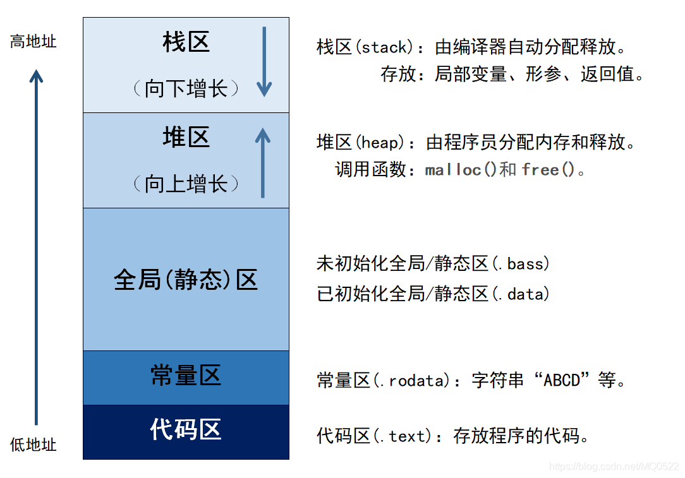

# 第 1 章 C++ 基础

**主要内容：基本类型、字符串、向量和数组、表达式、语句、函数（缺省函数、函数重载、内联函数）、引用。**

## 32位和64位系统对 C++ 结构体大小的影响

### 1. 基本数据类型的大小差异

在 32 位和 64 位系统中，部分基本数据类型的大小是固定不变的，但有些会发生变化。long和指针数据类型在32位系统占4字节，在64位系统占8字节。

### 2. 内存对齐规则

内存对齐是为了提高内存访问效率，编译器会在结构体成员之间插入填充字节。对齐规则通常与数据类型的大小和系统的字长有关。一般来说，结构体成员的起始地址必须是该成员类型大小的整数倍。

## 引用和指针的区别⭐

### 定义与本质

- **引用**：引用是对象的别名，它和所引用的对象本质上是同一个实体，只是有了另一个名称。引用一旦被创建，就和特定对象绑定在一起，代表该对象参与后续的操作。
- **指针**：指针是一个独立的变量，它存储的是另一个对象的内存地址。指针有自己独立的内存空间，其值是所指向对象的地址，通过这个地址可以间接访问对象。

### 初始化要求

- **引用**：必须在定义时进行初始化，因为引用一旦被创建就必须代表一个具体的对象，后续无法再重新绑定到其他对象。
- **指针**：可以在定义时不进行初始化，之后再通过赋值操作让它指向某个对象的地址。不过未初始化的指针是非常危险的，使用前需要确保它指向有效的内存地址。

### 空值情况

- **引用**：不能指向空值，不存在“空引用”的概念。引用必须始终关联一个有效的对象，这保证了引用在使用时的安全性，只要引用存在，就一定有对应的对象。
- **指针**：可以被赋值为 `null`（在 C++ 中用 `nullptr` 表示），表示它不指向任何有效的对象。在使用指针之前，通常需要检查它是否为 `nullptr`，以避免因空指针解引用而导致程序崩溃。

### 内存占用

- **引用**：从概念上看，引用不占用额外的内存空间，它只是作为对象的别名存在。但在实际的底层实现中，编译器可能会为引用分配一些内存来存储引用的相关信息。
- **指针**：指针本身是一个变量，会占用一定的内存空间，用于存储所指向对象的内存地址。其占用的内存大小取决于系统的位数，一般在 32 位系统中是 4 字节，64 位系统中是 8 字节。

### 可修改性

- **引用**：一旦初始化后，就不能再引用其他对象，它始终与初始化时的对象绑定在一起。后续对引用的操作实际上就是对所引用对象的操作。
- **指针**：指针可以在其生命周期内指向不同的对象，通过重新赋值可以改变它所指向的地址，具有较高的灵活性。

### 运算操作

- **引用**：引用主要用于访问和修改所引用的对象，不能进行像指针那样的算术运算。因为引用代表的是对象本身，而不是对象的地址，所以对引用进行算术运算没有实际意义。
- **指针**：指针可以进行多种算术运算，如加法、减法等。这些运算通常用于在数组等连续内存区域中移动指针位置，方便对不同位置的元素进行访问。

### 使用场景

- **引用**：常用于函数参数传递和返回值，这样可以避免对象的复制，提高程序的运行效率。同时，引用在运算符重载中也很常用，能让代码看起来更自然、更符合日常的数学表达习惯。
- **指针**：在动态内存分配、实现复杂的数据结构（如链表、树等）时非常有用。指针可以灵活地管理内存的分配和释放，以及对象之间的连接关系。

### **核心区别总结**

| **特性**           | **引用**                         | **指针**                   |
| ------------------------ | -------------------------------------- | -------------------------------- |
| **初始化要求**     | **必须初始化**，且绑定后不可改变 | 可以声明时不初始化（但危险）     |
| **空值（Null）**   | 不允许（必须绑定有效对象）             | 允许设为 `nullptr` 或 `NULL` |
| **重新绑定**       | 不能重新绑定到其他对象                 | 可以指向不同对象                 |
| **语法操作**       | 直接使用原变量名（无解引用符号）       | 需用 `*` 解引用，`&` 取地址  |
| **内存地址存在性** | 无独立内存地址（是别名）               | 自身有内存地址（存储目标地址）   |
| **参数传递语义**   | 传递引用（可能修改原对象）             | 传递地址（需显式解引用）         |
| **数组操作**       | 不支持直接操作数组                     | 支持指针算术（如 `ptr++`）     |
| **类型安全**       | 类型严格匹配（不能隐式转换）           | 允许类型转换（可能不安全）       |
| **多级间接访问**   | 仅支持一级引用（无引用的引用）         | 支持多级指针（如 `int**`）     |
| **内存管理**       | 自动管理（无需显式释放）               | 需手动管理（可能泄漏或悬垂指针） |

---

## static ⭐
## static int 用法

### 1. 静态局部变量
当 `static int` 用于函数内部时，它会被定义成静态局部变量。静态局部变量的特点是仅在第一次执行函数时初始化，之后函数再次被调用时，该变量会保留上一次调用结束时的值。

### 2. 静态全局变量
在全局作用域里使用 `static int` 能够定义静态全局变量。静态全局变量的作用域仅限于定义它的文件，其他文件无法访问该变量。

### 3. 类的静态成员变量
在类中使用 `static int` 可以定义类的静态成员变量。静态成员变量为类的所有对象所共享，它不属于某个特定的对象，而是属于整个类。`静态成员变量需要在类外进行初始化`。

### 4. 类的静态成员函数中的静态局部变量
在类的静态成员函数里，`static int` 也可以作为静态局部变量使用，其特性和普通函数中的静态局部变量相同。

# 第 2 章 类和对象

**主要内容：六大默认成员函数、初始化列表、静态成员和静态成员函数、友元**

## 构造函数初始化列表和在函数体进行初始化的区别？⭐

### 初始化时机与效率

- **构造函数初始化列表**：初始化列表中的初始化操作发生在构造函数体执行之前。对于类的成员变量，尤其是自定义类型的成员变量，使用初始化列表可以直接调用其对应的构造函数进行初始化。这避免了先调用默认构造函数再进行赋值操作，从而提高了效率。
- **构造函数体中初始化**：在构造函数体中进行初始化，实际上是先调用成员变量的默认构造函数进行默认初始化，然后在构造函数体中再进行赋值操作。对于自定义类型的成员变量，这会导致额外的默认构造和赋值操作，效率较低。

### 必须使用初始化列表的场景

- 以下情况必须使用初始化列表，否则会导致编译错误

  - **常量成员变量**：常量成员变量一旦被初始化就不能再被赋值，因此必须在初始化列表中进行初始化。
  - **引用成员变量**：引用必须在定义时就进行初始化，并且之后不能再引用其他对象，所以引用成员变量也必须在初始化列表中进行初始化。
  - **没有默认构造函数的类类型成员**：如果一个类的成员变量是另一个类类型，且该类没有默认构造函数，那么必须在初始化列表中显式调用其带参数的构造函数进行初始化。
- 对于上述提到的常量成员变量、引用成员变量以及没有默认构造函数的类类型成员，不能在构造函数体中进行初始化，只能使用初始化列表。而对于普通的成员变量，既可以在初始化列表中初始化，也可以在构造函数体中进行赋值初始化。

### 初始化顺序

- **构造函数初始化列表**：成员变量的初始化顺序是由它们在类中声明的顺序决定的，而不是初始化列表中出现的顺序。若初始化列表中顺序与声明顺序不一致，可能导致依赖错误。
- **构造函数体中初始化**：赋值操作的顺序由构造函数体中的代码顺序决定，但同样要注意成员变量本身的初始化顺序是由声明顺序决定的。
---
## 类的大小计算 ⭐
### 类的大小与哪些因素有关？
1. 普通成员变量：类中的非静态成员变量会直接影响类的大小。
2. 虚函数：每个包含虚函数的类都会有一个虚函数表指针（vfptr），这会增加类的大小。
3. 继承：继承关系会影响类的大小，包括单一继承、多重继承、重复继承和虚拟继承。
### 类的大小与哪些因素无关？
1. 静态成员变量：静态成员变量存储在全局区，不属于任何对象，因此不计入类的大小。
2. 成员函数：无论是静态成员函数还是普通成员函数，都不会影响类的大小。
### 空类的大小
空类，即没有任何成员变量和成员函数的类，其大小为1字节。这是因为C++标准规定，每个对象都必须有一个独一无二的地址，即使是空类。
### 内存对齐
类的大小计算还需要考虑内存对齐的问题。内存对齐是为了提高内存访问效率，编译器会按照一定的规则调整成员变量的排列，可能会导致类的大小增加。
### 虚函数和虚继承
1. 虚函数：类中的虚函数会导致类中增加一个虚函数表指针，通常在64位系统中，这个指针的大小为8字节。
2. 虚继承：虚继承会在类中增加一个虚基类指针（vbptr），用于解决菱形继承中的二义性问题和空间浪费问题。
### 多重继承
在多重继承中，如果派生类没有覆盖基类的虚函数，派生类的大小为所有非静态数据成员的大小加上一个虚函数表指针的大小。
# 第 3 章 C/C++内存管理

**主要内容：内存分布、new和delete、内容泄露**

## C++程序内存分类⭐



1. 栈区：由编译器管理分配和回收，存放的是局部变量、函数参数和返回值。
2. 堆区：使用 `malloc`、`new`申请的内存，需要程序员使用 `delete`、`free`手动释放。若不回收，会造成内存泄漏问题。
3. 全局(静态)区：存放全局变量、静态变量。分为初始化和未初始化两个相邻区域，存储初始化和未初始化的全局变量和静态变量。
4. 常量区：存放常量和字符串，一般不允许修改。
5. 代码区：存放程序的二进制代码。


## C++出现内存泄漏的原因及解决方法⭐⭐

在 C++ 中，内存泄漏的根本原因是动态分配的内存未被正确释放。

### 1. 手动内存管理失误

**原因**：

- 忘记调用 `delete`/`delete[]`：动态分配内存后，未在适当位置释放。
- 异常导致未释放内存：代码抛出异常后，未进入释放内存的代码路径。
  **解决方法**：
- 使用智能指针（`unique_ptr`/`shared_ptr`）：确保内存自动释放。

### 2. 指针覆盖或悬垂指针

**原因**：

- 指针被重新赋值：原指向的内存未被释放。
- 浅拷贝问题：多个指针指向同一内存，重复释放或遗漏释放。
  **解决方法**：
- 使用 `std::unique_ptr` 或深拷贝：避免多个指针管理同一资源。

### 3. 循环引用

**原因**：

- `shared_ptr` 互相引用：对象间形成循环依赖，引用计数无法归零。
  **解决方法**：
- 使用 `weak_ptr` 打破循环：将其中一个指针改为弱引用。

### 4. 容器存储裸指针未释放

**原因**：

- 容器销毁时未遍历释放裸指针。
  **解决方法**：
- 使用智能指针容器。

### 5. 未遵循 RAII 原则

**原因**：

- 资源未绑定对象生命周期，如文件句柄、网络连接等未在析构时关闭。
  **解决方法**：
- 封装资源管理类。

### 6. 多线程资源竞争

**原因**：

- 多线程重复释放或遗漏释放。**解决方法**：
- 使用原子操作或互斥锁。

### 类继承和多态中的内存管理问题

**原因**：

- 在使用类继承和多态时，如果基类的析构函数不是虚函数，通过基类指针删除派生类对象时，可能只会调用基类的析构函数，而不会调用派生类的析构函数，从而导致派生类中动态分配的内存无法释放。
  **解决方法**：
- 使用虚析构函数。

# 第 4 章 模板

**主要内容：函数模板、类模板、模板的特化**

# 第 5 章 I/O流

**主要内容：标准I/O流、文件I/O流和stringstream**

# 第 6 章 继承

**主要内容：继承方式、继承与默认成员函数、继承与友元、菱形继承**

# 第 7 章 多态

**主要内容：定义、原理和实现、抽象类**

---
## 构造函数里调用虚函数发生什么？⭐
在 C++ 中，**在构造函数中调用虚函数不会触发多态行为**，实际调用的版本是当前构造函数所属类的虚函数实现，而非派生类的重写版本。这是由对象的生命周期和虚函数表（vtable）的初始化顺序决定的。

### 核心原因：**对象构造的顺序**
1. **构造顺序**：  
   对象的构造是从基类到派生类依次完成的。当基类的构造函数执行时，**派生类部分尚未初始化**。
2. **虚表指针的初始化**：  
   虚函数通过虚函数表（vtable）实现多态，每个类的构造函数会设置对象内部的虚表指针（vptr），使其指向当前类的虚函数表。  
   - **基类构造函数执行时**：vptr 指向基类的虚函数表。  
   - **派生类构造函数执行时**：vptr 被更新为指向派生类的虚函数表。

因此，在基类构造函数中调用虚函数时，虚表指针尚未指向派生类的虚函数表，**无法触发多态**。


### 潜在风险
**访问未初始化的派生类成员**：若派生类的虚函数依赖其成员变量，但这些变量在基类构造函数执行时尚未初始化，会导致未定义行为。  

### 总结
在构造函数和析构函数中调用虚函数时，实际调用的版本是构造函数或析构函数所属类的版本，而非派生类的版本。

---

## 虚函数表是存在父类中还是子类中？⭐

### **结论**

虚函数表属于类，而非对象。**父类和子类各自拥有独立的虚函数表**。

如果子类重写（override）父类的虚函数，子类的虚函数表会覆盖对应的父类函数地址。未被重写的虚函数，子类虚函数表会保留父类的函数地址。子类新增的虚函数会扩展自己的虚函数表。

### **具体规则**

1. **父类的虚函数表**

   - 父类定义虚函数时，编译器会为父类生成一个虚函数表，记录所有虚函数的地址。
   - 父类对象实例化时，其内部的虚函数表指针（vptr）指向父类的虚函数表。
2. **子类的虚函数表**

   - 子类继承父类后，编译器会为子类生成**独立的虚函数表**。
     - **覆盖规则**：若子类重写父类虚函数，子类虚函数表中对应项替换为子类函数地址。
     - **继承规则**：未重写的虚函数，子类虚函数表保留父类的函数地址。
     - **扩展规则**：子类新增的虚函数会添加到子类的虚函数表中。

### **扩展**

1. **虚函数表是类的静态属性**

   - 每个类的虚函数表在编译时生成，与对象实例无关。
   - 所有该类的对象共享同一份虚函数表。
2. **vptr是对象的动态属性**

   - 每个对象实例的vptr在运行时动态指向当前类的虚函数表。
   - 多态的本质是通过vptr在运行时动态绑定正确的函数。
3. **多重继承的虚函数表**

   - 若子类继承多个父类（多重继承），每个父类对应一个独立的虚函数表，子类会合并这些表并处理覆盖逻辑。

## 虚函数的实现机制⭐

虚函数是实现多态性的重要手段，它允许在基类中定义函数，在派生类中重写该函数，并且可以通过基类指针或引用调用派生类的重写函数。虚函数的实现主要依赖于虚函数表（Virtual Table，VTable）和虚表指针（Virtual Table Pointer，VPTR）。

1. 虚函数表（VTable）
   定义：虚函数表是一个存储类的虚函数地址的数组，每个包含虚函数的类都有自己的虚函数表。虚函数表在编译时由编译器为每个包含虚函数的类创建，它存储了该类所有虚函数的地址。
   作用：虚函数表的主要作用是在运行时确定要调用的虚函数的地址，从而实现动态绑定。
   虚函数表存放在只读数据段（.rodata）中，即常量区。
2. 虚表指针（VPTR）
   定义：虚表指针是一个隐藏的指针，每个包含虚函数的类的对象都有一个虚表指针，它指向该对象所属类的虚函数表。虚表指针在对象创建时被初始化，指向该对象所属类的虚函数表。
   作用：通过虚表指针，对象可以在运行时找到其所属类的虚函数表，进而找到要调用的虚函数的地址。

## 为什么构造函数一般不定义为虚函数？而析构函数一般写成虚函数？⭐

1. 构造函数不能声明为虚函数
   - 从实现角度：因为创建一个对象时需要确定对象的类型，而虚函数是在运行时确定其类型的。而在构造一个对象时，由于对象还未创建成功，编译器无法知道对象的实际类型，也就无法完成构造。
   - 从存储空间角度：虚函数的调用需要虚函数表指针，而该指针存放在对象的内存空间中；若构造函数声明为虚函数，那么由于对象还未创建，还没有内存空间，更没有虚函数表地址用来调用虚函数即构造函数了。
2. 析构函数最好声明为虚函数
   - 首先析构函数可以为虚函数，当析构一个指向派生类的基类指针时，最好将基类的析构函数声明为虚函数，否则可以存在内存泄露的问题。
   - 如果析构函数不被声明成虚函数，则编译器实施静态绑定，在删除指向派生类的基类指针时，只会调用基类的析构函数而不调用派生类析构函数，这样就会造成派生类对象析构不完全。
  
---
## 析构函数为什么要设置成虚函数？⭐

### **1. 多态对象销毁的必要性**
当使用 **基类指针** 指向 **派生类对象** 时，若基类析构函数非虚，删除该指针只会调用 **基类析构函数**，导致派生类资源未释放，引发内存泄漏。

### **2. 虚析构函数的作用**
将基类析构函数声明为虚函数后，通过基类指针删除对象时，会 **动态绑定** 到实际对象的析构函数，确保派生类析构函数被调用。

### **3. 底层机制：虚函数表（vtable）**
- **虚析构函数的实现原理**：  
  当类有虚函数时，编译器会为其生成一个**虚函数表（vtable）**，其中包含虚函数的地址。  
  - 对象内部会存储一个指向 vtable 的指针（vptr）。  
  - 虚析构函数的地址会被写入 vtable，确保通过基类指针删除对象时，能正确调用实际类型的析构函数。

- **析构顺序**：  
  1. 调用派生类的析构函数。  
  2. 调用基类的析构函数。  
  3. 释放对象内存。

---
## 多态及其分类
C++多态方式：

（1）静态（编译时）多态（重载，模板）

是在编译的时候，就确定调用函数的类型。

（2）动态（运行时）多态（虚函数实现）

在运行的时候，才确定调用的是哪个函数，动态绑定。运行基类指针指向派生类的对象，并调用派生类的函数。

---

## 运行时多态的实现

---
## 多态的应用场景⭐

多态是面向对象编程的核心特性之一，它允许通过基类接口处理不同派生类对象，从而提高代码的灵活性和可维护性，分为运行时多态（动态多态）和编译时多态（静态多态）。

1. 框架/库设计
   场景：设计通用框架时，基类定义接口，派生类实现具体逻辑。
   示例：GUI库中的控件基类定义绘制接口，具体控件（按钮、文本框）实现自己的绘制逻辑。
2. 插件系统/动态扩展
   场景：支持动态加载不同功能模块，基类定义插件接口，第三方实现具体功能。
   示例：图像处理软件支持不同滤镜插件。
3. 游戏开发
   场景：管理不同类型的游戏对象（敌人、NPC等），统一处理共性行为。
   示例：不同敌人实现不同的攻击逻辑。
4. 回调与事件处理
   场景：定义通用事件处理器接口，不同事件触发不同处理逻辑。
   示例：GUI事件处理（点击、键盘事件）。
5. 设计模式应用
   场景：实现常见设计模式（如工厂模式、策略模式）。
   - 工厂模式：
     通过基类指针返回具体子类对象，隐藏对象创建细节。
     典型场景：动态创建不同子类对象。
   - 策略模式
     通过虚函数动态切换算法或策略。
     典型场景：运行时选择不同的算法实现。
6. 数据序列化
   场景：统一处理不同数据格式的序列化（JSON、XML、二进制）。
7. 模板多态（编译时多态）
   通过模板和函数重载实现类型无关的通用逻辑。
   场景：泛型编程（如 STL 容器和算法）。
8. 统一处理对象集合
   当不同子类对象需要被统一管理或操作时，多态允许通过父类或接口类型进行批量处理。
   场景：图形绘制。
9. 数据库与资源访问
   通过抽象接口屏蔽底层资源差异。

# 第 8 章 C++ 11

**主要内容：右值引用和移动语义、lambda表达式、线程库**

## Lambda表达式与 `std::bind`的区别⭐

### 1. **语法与可读性**

- **Lambda表达式**：语法简洁，可直接内联定义，支持按值或按引用捕获局部变量。
- **`std::bind`**：
  需要显式绑定函数和参数，依赖占位符（`_1`, `_2`等）调整参数顺序，代码较冗长。

### 2. **捕获能力**

- **Lambda表达式**：

  - 支持按值捕获（`[x]`）、按引用捕获（`[&x]`）、混合捕获（`[=, &x]`）。
  - C++14允许广义捕获（可初始化捕获变量）：
- **`std::bind`**：

  - 只能通过参数传递值或引用，无法直接捕获作用域内的局部变量，需显式绑定。

### 3. **参数处理**

- **Lambda表达式**：参数列表直接定义在 `[]`后的 `()`中，可接受任意数量和类型的参数。
- **`std::bind`**：
  支持重新排列参数顺序（通过占位符 `_1`, `_2`等）。

### 4. **类型推导与闭包对象**

- **Lambda表达式**：每个Lambda表达式生成唯一的闭包类型，类型由编译器自动推导。
- **`std::bind`**：
  返回的绑定对象类型是未指定的，通常用 `auto`或 `std::function`存储。

### 5. **性能**

- **Lambda表达式**：通常更高效，编译器可直接内联优化。
- **`std::bind`**：
  可能引入间接调用（如绑定成员函数指针），存在额外开销。

## Lambda表达式引用捕获的风险⭐

### 1. **悬挂引用（Dangling Reference）**

- **风险场景**：
  Lambda按引用捕获局部变量后，若该变量在Lambda执行前被销毁，将导致未定义行为。

### 2. **多线程竞争条件**

- **风险场景**：
  Lambda按引用捕获共享数据时，多线程环境下未同步访问可能导致数据竞争(计算结果不一致)。

### 3. **意外修改外部变量**

- **风险场景**：
  按引用捕获的变量可能被Lambda意外修改，尤其是当Lambda被传递到其他作用域时。

## 如何避免引用捕获的风险？⭐

### 1. **优先按值捕获**

- 对于局部变量，尽量使用按值捕获（`[x]`或 `[=]`），避免生命周期问题。

### 2. **使用智能指针延长生命周期**

- 若需共享数据，用 `shared_ptr`按值捕获：

### 3. **明确捕获意图**

- 使用显式捕获列表（如 `[&x]`而非 `[&]`），避免意外捕获不需要的变量。

### 4. **同步多线程访问**

- 对共享数据使用互斥锁（`std::mutex`）或原子变量（`std::atomic`）：

### 5. **限制Lambda生命周期**

- 确保Lambda的执行生命周期不超过其捕获引用的变量。

## 右值引用⭐⭐

右值引用（Rvalue Reference）是 C++11 引入的核心特性之一，用于实现**移动语义**（Move Semantics）和**完美转发**（Perfect Forwarding）。它的核心目标是**减少不必要的资源拷贝**，提升程序性能。

### 1. **左值 vs 右值**

- **左值（Lvalue）**：可以取地址、有持久状态的对象（如变量、具名对象）。
- **右值（Rvalue）**：
  临时对象、字面量、表达式计算的中间结果（如 `x+1`、函数返回的临时对象）。

### 2. **右值引用的定义**

- **语法**：用 `&&` 表示右值引用。
- **作用**：绑定到临时对象（右值），表示可以“窃取”其资源。

### 3. **移动语义（Move Semantics）**

- **核心思想**：将资源（如堆内存）从临时对象“移动”到新对象，避免深拷贝。
- **实现方式**：
  定义**移动构造函数**和**移动赋值运算符**，接受右值引用参数。

### 4. **`std::move` 的作用**

- **功能**：将左值强制转换为右值引用，表示该对象可以被“移动”。
- **注意**：
  - `std::move` 本身不执行移动操作，仅标记对象为可移动。
  - 调用后，原对象的状态是未定义的（通常被置空）。

#### 示例：

```cpp
std::vector<int> v1 = {1, 2, 3};
std::vector<int> v2 = std::move(v1); // v1 现在为空
```

---

### 5. **完美转发（Perfect Forwarding）**

- **目标**：在模板函数中保持参数的原始类型（左值/右值）。
- **实现方式**：结合**通用引用**（`T&&`）和 `std::forward`。

#### 示例：

```cpp
template<typename T>
void wrapper(T&& arg) {
    // 保持 arg 的原始类型（左值或右值）
    target(std::forward<T>(arg));
}
```

- **通用引用**（`T&&`）会根据传入参数类型推导为左值或右值引用。
- `std::forward<T>(arg)` 按需转发为左值或右值。

---

### 6. **右值引用的应用场景**

1. **容器优化**：

   ```cpp
   std::vector<std::string> vec;
   vec.push_back("Hello");  // 移动临时字符串，而非拷贝
   ```
2. **资源管理类**（如 `std::unique_ptr`）：

   ```cpp
   std::unique_ptr<int> p1 = std::make_unique<int>(42);
   std::unique_ptr<int> p2 = std::move(p1); // 转移所有权
   ```
## 在 C++ 中，使用 move 移动一个 vector 和移动一个 int 的区别。

### 语义层面
- **移动 int**：int 是基本数据类型，它是不可变的，没有资源管理的概念。当使用 `std::move` 移动一个 int 时，实际上只是进行了一次值的拷贝。

- **移动 vector**：vector 是一个容器类，它管理着动态分配的内存资源。当使用 `std::move` 移动一个 vector 时，会将原 vector 的资源所有权转移到新的 vector 中，原 vector 会变为空，避免了大量数据的复制。

### 底层实现层面
- **移动 int**：由于 int 是基本数据类型，编译器会直接进行值的复制操作，不涉及复杂的底层逻辑。赋值操作通常是通过简单的寄存器操作完成的。

- **移动 vector**：vector 的移动操作涉及到资源的转移。vector 内部通常包含指向动态分配数组的指针、数组的大小和容量等信息。在移动操作中，新的 vector 会直接接管原 vector 的指针，同时将原 vector 的指针置为 `nullptr`，避免在原 vector 析构时释放已经转移的资源。

### 性能影响层面
- **移动 int**：移动 int 的性能开销非常小，因为只是简单的值复制，时间复杂度为 $O(1)$，并且不会涉及内存分配和释放操作。

- **移动 vector**：使用move移动vector只需要进行指针交换，时间复杂度为 $O(1)$。如果不采用move，则需要直接复制整个vector，时间复杂度为$O(n)$。

# 第 9 章 异常

# 第 10 章 智能指针

---

## unique_ptr是怎么实现的(实现原理)？⭐
### 1. 实现原理

unique_ptr 的核心实现原理基于独占所有权和资源管理。它通过将拷贝构造函数和拷贝赋值运算符删除，确保同一时间只有一个 unique_ptr 可以指向某个对象。当 unique_ptr 被销毁时，它会自动释放所管理的对象，避免了内存泄漏。

### 2. 核心特性
- **独占所有权**：同一时间只能有一个 `unique_ptr` 指向资源。
- **禁止拷贝**：删除拷贝构造函数和拷贝赋值运算符。
- **允许移动**：通过移动构造函数和移动赋值运算符转移所有权。
- **自动释放资源**：析构时调用删除器（默认 `delete`）释放资源。

### 2. 核心数据结构
unique_ptr 包含两个关键成员：

- **指针 ptr**：直接指向动态分配的对象或数组。
- ​删除器（Deleter）​：用于销毁对象（默认为 delete 或 delete[]）。

### 3. 关键实现细节

#### （1）禁止拷贝
通过 `delete` 关键字禁用拷贝操作。

#### （2）允许移动
定义移动构造函数和移动赋值运算符，转移资源所有权。

#### （3）资源释放
析构函数调用删除器释放资源。

#### （4）常用成员函数
- `T* get()`：返回原始指针（不释放所有权）。
- `T* release()`：返回原始指针并放弃所有权（`ptr` 置为 `nullptr`）。
- `void reset(T* new_ptr = nullptr)`：释放当前资源，接管新指针。
- `operator*` 和 `operator->`：提供类似裸指针的访问方式。

---

## 介绍一下智能指针，将普通指针转换成智能指针有什么风险？⭐

### 智能指针介绍

在C++中，智能指针是一种用于管理动态分配内存的工具，它可以自动处理内存的释放，避免手动管理内存时容易出现的内存泄漏问题。智能指针本质上是一个类模板，通过RAII（资源获取即初始化）技术，在对象构造时获取资源，在对象析构时释放资源。C++标准库提供了三种主要的智能指针：`std::unique_ptr`、`shared_ptr` 和 `std::weak_ptr`。

#### 1. `std::unique_ptr`

- **特点**：`std::unique_ptr` 独占所指向的对象，同一时间只能有一个 `std::unique_ptr` 指向该对象。当 `std::unique_ptr` 被销毁时，它所指向的对象也会被自动销毁。

#### 2. `shared_ptr`

- **特点**：`shared_ptr` 允许多个 `shared_ptr` 共享同一个对象，通过引用计数来管理对象的生命周期。每当一个新的 `shared_ptr` 指向该对象时，引用计数加1；当一个 `shared_ptr` 被销毁或不再指向该对象时，引用计数减1。当引用计数为 0 时，对象会被自动销毁。

#### 3. `std::weak_ptr`

- **特点**：`std::weak_ptr` 通常与 `shared_ptr` 配合使用，它不增加引用计数，主要用于解决 `shared_ptr` 的循环引用问题。`std::weak_ptr` 可以通过 `lock()` 方法获取一个 `shared_ptr`，从而访问所指向的对象。

### 将普通指针转换成智能指针的风险⭐

#### 1. 所有权转移问题

- 当将普通指针转换为智能指针时，需要明确所有权的转移。如果不小心将同一个普通指针同时交给多个智能指针管理，会导致重复释放内存的问题。

#### 2. 悬空指针问题

- 如果在将普通指针转换为智能指针后，仍然保留对普通指针的使用，并且智能指针已经释放了所指向的对象（离开作用域时自动释放），那么普通指针就会变成悬空指针，继续使用悬空指针会导致未定义行为。

#### 3. 内存泄漏风险

- 如果在转换过程中没有正确处理异常，可能会导致内存泄漏。

---

## share_ptr(共享指针)的实现原理。⭐⭐
shared_ptr 是 C++ 中最常用的智能指针之一，其核心是**引用计数**和**控制块**机制。它允许多个指针共享同一对象的所有权，并在最后一个所有者销毁时自动释放资源。

### 关键组成部分（底层实现）
#### 1. 核心数据结构
每个 `shared_ptr` 包含两个指针：
- **指向对象的指针**（`T* ptr`）：直接访问对象。
- **指向控制块的指针**（`ControlBlock* ctrl`）：管理引用计数和资源释放。
#### 2. 控制块
每个被 `shared_ptr` 管理的对象都关联一个**隐藏的控制块**，其中包含以下关键信息：
- **指向对象的指针**（`T* ptr`）：实际管理的堆内存对象。
- **强引用计数**（`use_count`）：记录当前有多少个 `shared_ptr` 共享该对象。
- **弱引用计数**（`weak_count`）：记录 `weak_ptr` 的数量（不参与对象生命周期的管理）。
- **删除器**（`Deleter`）：自定义的销毁函数（默认调用 `delete`）。
- **分配器**（`Allocator`）：可选，用于控制块和对象的内存分配。
#### 3. 构造函数
- **默认构造函数**：创建一个不指向任何对象的 `shared_ptr`，其引用计数为 0。
- **带原始指针的构造函数**：接受一个原始指针，创建一个新的 `shared_ptr` 并让其指向该指针所指向的对象，同时创建一个新的控制块，引用计数初始化为 1。
- **拷贝构造函数**：用一个已有的 `shared_ptr` 创建一个新的 `shared_ptr`，它们指向同一个对象，引用计数加 1。
- **移动构造函数**：将一个 `shared_ptr` 的所有权转移给另一个 `shared_ptr`，原 `shared_ptr` 不再指向该对象，引用计数不变。

#### 4. 赋值运算符
- **拷贝赋值运算符**：将一个 `shared_ptr` 的值赋给另一个 `shared_ptr`。如果目标 `shared_ptr` 原来指向一个对象，会先将该对象的引用计数减 1，然后将新对象的引用计数加 1。
- **移动赋值运算符**：将一个 `shared_ptr` 的所有权转移给另一个 `shared_ptr`，原 `shared_ptr` 不再指向该对象，引用计数不变。

#### 5. 析构函数
当一个 `shared_ptr` 被销毁时，析构函数会将所指向对象的引用计数减 1。如果引用计数变为 0，则释放对象所占用的内存以及控制块。

#### 6. 解引用运算符和箭头运算符
重载了 `*` 和 `->` 运算符，使得 `shared_ptr` 可以像普通指针一样使用，方便对所指向的对象进行访问。

---

## shared_ptr是线程安全的吗？⭐
计数线程安全，指针线程不安全。
- **引用计数的原子性**：  
  `use_count` 和 `weak_count` 通过 `std::atomic` 实现原子操作，确保多线程环境下计数的正确性。
- **对象访问的非原子性**：  
  `shared_ptr` 的拷贝和析构是线程安全的，但通过 `ptr` 直接访问对象仍需外部同步（如互斥锁）。

# 第 11 章 类型转换

