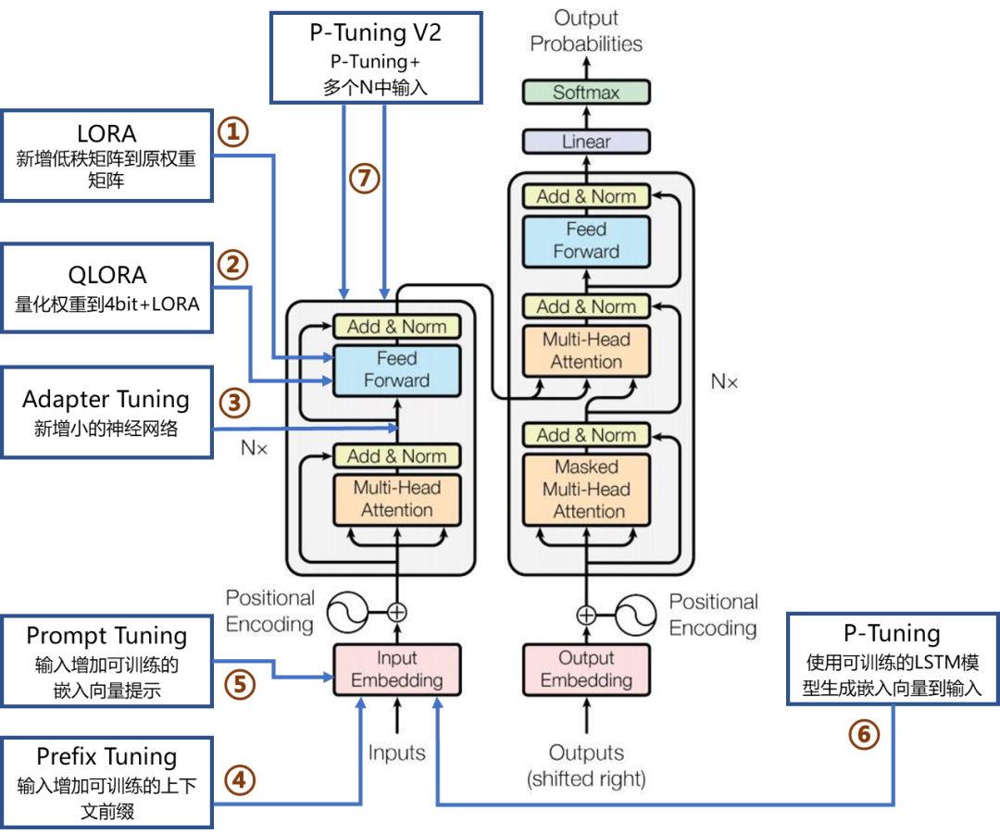

# LoRA简介
LoRA的核心思想是，在冻结预训练模型权重后，将可训练的低秩分解矩阵注入到的Transformer架构的每一层中，从而大大减少了在下游任务上的可训练参数量。
## 具体做法
1. 在原模型旁边增加一个旁路，通过低秩分解来模拟参数的更新量$\Delta{W}$；
2. 训练时，原模型固定，只训练矩阵A、B；
3. 推理时，可将BA加到原参数上，不引入额外的推理延迟；
4. 初始化，A采用高斯函数初始化，B初始化为全0，保证训练开始时旁路为0矩阵；
## 优势
1. 存储与计算效率：通过低秩适应（LoRA），可以显著减少所需存储的参数数量，并减少计算需求。
2. 适应性与灵活性: LoRA方法允许模型通过只替换少量特定的矩阵A和B来快速适应新任务，显著提高任务切换的效率。当前任务$W_0+B_1A_1$，将lora部分换成$B_2A_2$，即可实现任务切换。
3. 训练与部署效率：LoRA的简单线性设计允许在不引入推理延迟的情况下，与冻结的权重结合使用，从而提高部署时的操作效率。
# QLoRA 
QLoRA 同时结合了模型量化和 LoRA 参数微调两种方法。QLoRA 针对模型权重（weight）做量化，采用的是对称量化算法。

## 量化部分的创新点：
1. **采用新的 NF（NormalFloat）数据类型**，它是对于正态分布权重而言信息理论上最优的数据类型，同时，NF 类型有助于缓解异常值的影响；
   - int4 的格点分布是均匀的，然而模型的权重通常服从均值为 0 的正态分布，因此格点的分布和数据的分布不一致。
   - NF4 的格点按照正态分布的分位数截取，格点分布两端稀疏，中间密集，格点分布与数据分布一致。这样格点分配的效率就大大增加了，同时精度受损也不会太大。

2. **Double Quant**，对于量化后的 scale 数据做进一步的量化；
   - QLoRA 将每 64 个参数为做一个 block，即 block_size = 64，每个 block 计算一个 Scale。由于量化后的 Scale 通常以 FP32 存储，在 block 数众多的情况下，Scale 占用的显存也不可忽视。因此，QLoRA 对 Scale 进一步量化成 FP8，取 Double Quant 的 block size = 256，因而进一步降低了显存消耗。

   - Double Quant 前，每个参数做量化会需要额外的 32/64 = 0.5 bits 显存；Double Quant 后，每个参数做量化只需要额外的 8/64 + 32 / (64*256) = 0.127 bits 显存。
# 面试题
## 讲一讲lora和qlora ⭐⭐

## lora微调每个超参数的含义和作用 ⭐
在LoRA（Low-Rank Adaptation）微调中，超参数的设置直接影响模型的性能、训练效率和泛化能力。LoRA的核心是通过低秩矩阵分解减少待更新参数数量，因此其超参数可分为**LoRA特有超参数**（与低秩适应机制强相关）和**微调通用超参数**（适用于各类模型微调）。以下是关键超参数的含义和作用：

### 一、LoRA特有超参数
这些超参数是LoRA算法设计特有的，直接决定低秩矩阵的结构和对原模型的适配方式。

#### 1. 秩（Rank，简称`r`）
- **含义**：LoRA将权重更新矩阵$\Delta W$分解为两个低秩矩阵$W_A$（维度为$d \times r$）和$W_B$（维度为$r \times d$）的乘积（即$\Delta W = W_A \cdot W_B$），其中`r`是低秩矩阵的秩（列数/行数）。
- **作用**：  
  秩`r`是LoRA最核心的超参数，直接控制低秩矩阵的表达能力和参数数量：  
  - `r`越小：低秩矩阵的参数越少（总参数为$r \times (d + d) = 2rd$，远小于原矩阵$d \times d$的参数），训练速度更快、内存占用更低，但表达能力有限（可能无法捕捉复杂任务模式）。  
  - `r`越大：表达能力越强（可拟合更复杂的任务差异），但参数数量和计算成本增加（接近全量微调）。  
- **常见取值**：实际应用中`r`通常设为8、16、32、64（如文本分类任务常用8-16，复杂生成任务可能用32-64），需在性能和效率间平衡。

#### 2. 缩放因子（Alpha，简称`α`）
- **含义**：LoRA中最终的权重更新为$\Delta W = \frac{\alpha}{r} \cdot (W_A \cdot W_B)$，其中`α`是缩放因子，用于调节低秩矩阵乘积的贡献强度。
- **作用**：  
  核心是通过$\frac{\alpha}{r}$的比值控制低秩更新对原模型的影响幅度：  
  - 当`α`固定时，`r`越小，$\frac{\alpha}{r}$越大，低秩更新的贡献越强（可增强任务适配性）；  
  - 当`r`固定时，`α`越大，低秩更新的贡献越强（但需避免过度覆盖原模型的预训练知识）。  
- **实践技巧**：通常`α`设置为`r`的整数倍（如`r=8`时`α=16`，此时$\frac{\alpha}{r}=2$），方便通过`r`快速控制缩放幅度。

#### 3. 目标模块（Target Modules）
- **含义**：指在预训练模型中，哪些模块需要插入LoRA适配层（即对哪些层的权重更新应用低秩分解）。
- **作用**：  
  不同模块对任务的敏感性不同，选择合适的目标模块直接影响微调效果：  
  - 若目标模块太少：模型无法充分适配任务（欠拟合）；  
  - 若目标模块太多：参数数量增加，可能过拟合或覆盖原模型知识。  
- **常见选择**：  
  - Transformer模型中，通常选择注意力层的**查询（Query）和值（Value）投影层**（如BERT的`query_layer`、`value_layer`，GPT的`c_attn`层），因为注意力机制是模型理解上下文的核心；  
  - 避免选择基础层（如嵌入层、输出层），防止破坏预训练的语义映射。

#### 4. 是否冻结预训练参数（Freeze Pretrained Weights）
- **含义**：控制训练过程中是否固定预训练模型的原始参数（仅更新LoRA的低秩矩阵$W_A$和$W_B$）。
- **作用**：  
  LoRA的核心优势之一是“冻结预训练参数”，仅更新低秩矩阵（参数量极少），从而：  
  - 减少训练内存占用（无需存储原模型参数的梯度）；  
  - 避免过度修改预训练知识（降低过拟合风险）。  
- **注意**：若任务与预训练领域差异极大，可尝试“部分解冻”（少量预训练层与LoRA参数共同更新），但会增加复杂度。

### 二、微调通用超参数
这些超参数适用于各类模型微调（包括全量微调、LoRA微调等），但在LoRA场景下需结合低秩特性调整。

#### 1. 学习率（Learning Rate，简称`lr`）
- **含义**：参数更新的步长（梯度下降时，参数 = 原参数 - 学习率×梯度）。
- **作用**：  
  LoRA中仅更新低秩矩阵$W_A$和$W_B$（参数量远小于全量微调），因此学习率通常**大于全量微调**（全量微调可能用1e-5~5e-5，LoRA可用1e-4~5e-4）：  
  - 学习率过低：低秩参数收敛慢，训练轮数需求增加；  
  - 学习率过高：参数更新不稳定，可能跳过最优解（尤其`r`较小时，低秩矩阵容错性差）。  

#### 2. 训练轮数（Epochs）
- **含义**：模型在训练集上完整迭代的次数。
- **作用**：  
  LoRA参数少，收敛速度通常快于全量微调，但需足够轮数让低秩矩阵学到任务模式：  
  - 轮数太少：低秩矩阵未充分拟合任务（欠拟合）；  
  - 轮数太多：低秩矩阵过度拟合训练集细节（过拟合，尤其小数据集）。  
- **参考范围**：小数据集（<1万样本）通常5~20轮，大数据集（>10万样本）可3~10轮。

#### 3. 批处理大小（Batch Size）
- **含义**：每次模型更新时输入的样本数量（如batch size=32表示一次输入32个样本计算梯度）。
- **作用**：  
  - 影响训练效率：更大的batch size可利用GPU并行计算加速，减少迭代次数；  
  - 影响梯度稳定性：batch size太小，梯度估计噪声大（训练波动）；太大则内存占用高，且梯度可能过于平滑（错过局部最优）。  
- **LoRA适配**：LoRA参数少，对内存需求低，batch size可设得比全量微调更大（如全量微调用16，LoRA可用32~64）。

#### 4. Dropout率
- **含义**：训练时随机将部分神经元的输出设为0的概率（如dropout=0.1表示10%的神经元被丢弃）。
- **作用**：  
  防止低秩矩阵过拟合（LoRA参数少，更容易记住训练集噪声）：  
  -  dropout率过高：模型学习信号被过度抑制（欠拟合）；  
  -  dropout率过低：无法有效抑制过拟合。  
- **常见取值**：0.1~0.3（任务越简单、数据集越小，可适当提高）。

#### 5. 权重衰减（Weight Decay）
- **含义**：在损失函数中加入参数的L2范数惩罚（即损失 = 任务损失 + 权重衰减系数×$\sum \theta^2$，$\theta$为LoRA的低秩参数）。
- **作用**：  
  限制低秩参数的大小，防止参数过大导致过拟合（尤其`r`较大时，低秩矩阵表达能力强，更需约束）。  
- **常见取值**：1e-4~1e-2（数据集较小时可适当增大）。

### 三、超参数设置的核心原则
1. **优先调优LoRA特有参数**：`r`和`α`直接决定低秩矩阵的表达能力，建议先固定`α = r`（即$\frac{\alpha}{r}=1$），通过`r`（8→16→32）测试性能拐点；  
2. **适配任务复杂度**：简单任务（如文本分类）用小`r`（8~16）+ 低学习率（1e-4）；复杂任务（如对话生成）用大`r`（32~64）+ 高学习率（3e-4）；  
3. **平衡效率与性能**：算力有限时，减小`r`、增大batch size；追求最优性能时，适当增加`r`和训练轮数。

通过合理设置上述超参数，LoRA可在大幅降低计算成本的同时，达到接近全量微调的性能。

## 
在LoRA微调训练过程中，**仅调整低秩适应矩阵的参数**，而预训练模型的原始权重保持冻结（不更新）。具体来说，训练时调整的参数是低秩分解后的两个矩阵$W_A$和$W_B$，以及可选的缩放因子$\alpha$（若将其设为可训练参数）。

### 一、核心调整参数
#### 1. 低秩矩阵$W_A$和$W_B$
- **参数说明**：  
  LoRA将原始权重矩阵$W$的更新分解为$\Delta W = \frac{\alpha}{r} \cdot (W_A \cdot W_B)$，其中：  
  - $W_A$：形状为$d \times r$的矩阵（$d$是原始权重维度，$r$是秩），通常初始化为随机高斯分布；  
  - $W_B$：形状为$r \times d$的矩阵，通常初始化为零矩阵（确保训练开始时$\Delta W=0$，不改变原模型行为）。  
- **训练过程**：  
  模型前向传播时，实际使用的权重为$W_{\text{new}} = W + \Delta W$；反向传播时，梯度仅计算并更新$W_A$和$W_B$，而原始权重$W$保持不变。

#### 2. 缩放因子$\alpha$（可选）
- **参数说明**：  
  $\alpha$是控制低秩更新强度的缩放因子，通常作为超参数固定（如设为$r$的整数倍）。但在某些实现中，也可将$\alpha$设为可训练参数（需极小的学习率），让模型自动学习最优缩放比例。

### 二、不调整的参数
#### 1. 预训练模型的原始权重
- LoRA的核心优势是**冻结预训练模型的所有原始参数**（如Transformer的注意力层权重、MLP层权重等），仅通过低秩矩阵注入任务特定知识。这大幅减少了训练参数数量（例如，GPT-3 175B模型全量微调需175B参数，而LoRA（r=16）仅需约1.4M参数）。

### 三、对比其他微调方法
| 方法        | 调整的参数                            | 特点                                   |
| ----------- | ------------------------------------- | -------------------------------------- |
| 全量微调    | 所有模型参数                          | 参数量大、计算成本高，但性能可能最优   |
| LoRA微调    | 低秩矩阵$W_A$、$W_B$（+可选$\alpha$） | 参数量极少、训练高效，适合资源受限场景 |
| Adapter微调 | 插入的小型Adapter层参数               | 参数量中等，需修改模型架构             |
| P-Tuning/v2 | 连续提示（Prompt）参数                | 不改变模型权重，仅学习输入提示         |

通过仅调整低秩矩阵参数，LoRA在保持预训练模型核心能力的同时，高效注入任务特定知识，实现了参数高效微调的目标。

## LoRA微调过程
LoRA（Low-Rank Adaptation）微调大模型的过程可分为**准备阶段**、**配置阶段**、**训练阶段**和**应用阶段**。以下是具体步骤和关键细节：

### 一、准备阶段
#### 1. 环境搭建
- **依赖安装**：安装transformers、datasets、peft、accelerate、bitsandbytes等库。
  - `peft`：Hugging Face的参数高效微调库，集成LoRA；
  - `bitsandbytes`：支持模型量化（如4-bit/8-bit）以节省显存；
  - `accelerate`：简化多GPU/TPU训练。

#### 2. 数据准备
- **格式要求**：输入数据需转换为模型可接受的格式（如JSONL、CSV），通常包含`input`和`target`字段。

#### 3. 模型选择
- **下载预训练模型**：选择目标预训练模型（如gpt2-large、llama-7b、bloom-7b1等）。

### 二、配置阶段
#### 1. 定义LoRA参数
- **关键配置**：设置低秩矩阵的秩、缩放因子、目标模块、Dropout率等参数，然后将LoRA配置应用到模型上。

#### 2. 数据预处理
- **分词与格式化**：对输入和目标文本进行分词处理，并设置最大长度和截断策略。

### 三、训练阶段
#### 1. 配置训练参数
- **使用Hugging Face Trainer**：设置输出目录、学习率、批次大小、训练轮数等训练参数。

#### 2. 启动训练
- **单GPU/多GPU训练**：使用配置好的训练器进行训练，并保存LoRA模型。

#### 3. 优化显存使用（可选）
- **模型量化**：通过4-bit量化等方式加载模型，以节省显存。

### 四、应用阶段
#### 1. 加载LoRA权重进行推理
- **合并LoRA权重到基础模型**：将训练好的LoRA权重加载到基础模型上，并可选择合并LoRA权重。

#### 2. 生成文本
- **推理示例**：使用训练好的模型进行文本生成。

### 五、关键超参数调优
| 参数             | 作用                       | 推荐范围                     |
| ---------------- | -------------------------- | ---------------------------- |
| `r`              | 低秩矩阵的秩，控制参数量   | 8~64（任务越复杂值越大）     |
| `lora_alpha`     | 缩放因子，调节LoRA更新强度 | 通常设为`r`的2~4倍           |
| `learning_rate`  | 控制参数更新步长           | 1e-4~5e-4（高于全量微调）    |
| `target_modules` | 指定需调整的模型模块       | 注意力层的`q_proj`、`v_proj` |

### 六、常见问题与解决方案
1. **显存溢出**：
   - 减小batch size；
   - 使用4-bit量化；
   - 启用梯度检查点。

2. **训练效果不佳**：
   - 增大`r`值以增强表达能力；
   - 调整`lora_alpha`；
   - 尝试不同的`target_modules`。

3. **模型不收敛**：
   - 降低学习率；
   - 增加训练轮数；
   - 检查数据预处理是否正确。

通过上述步骤，你可以高效地使用LoRA微调大模型，在保持模型核心能力的同时，快速适应特定任务需求。