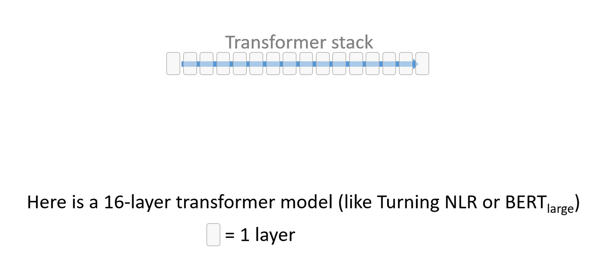
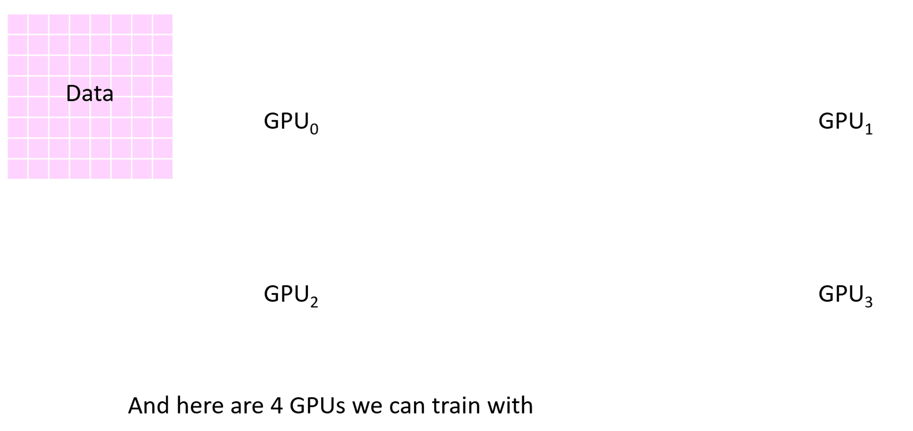
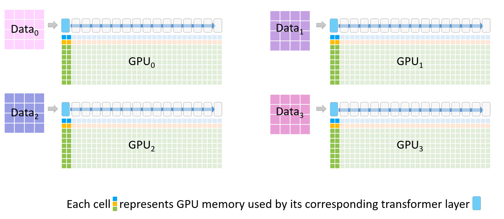
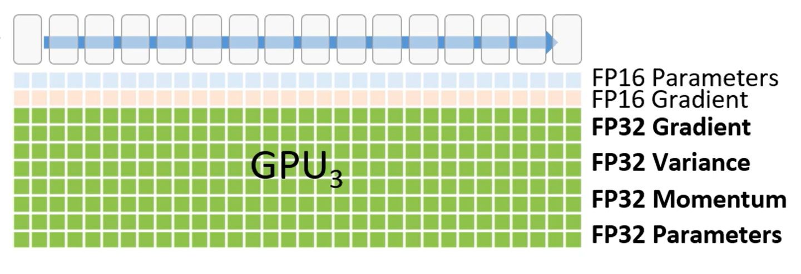
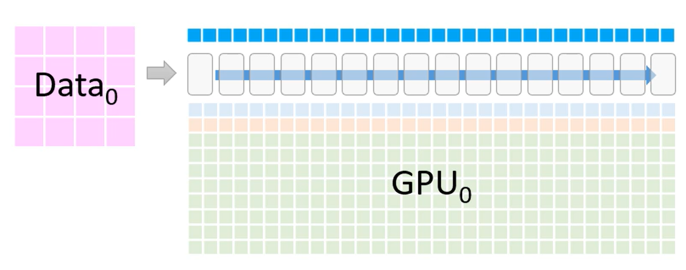
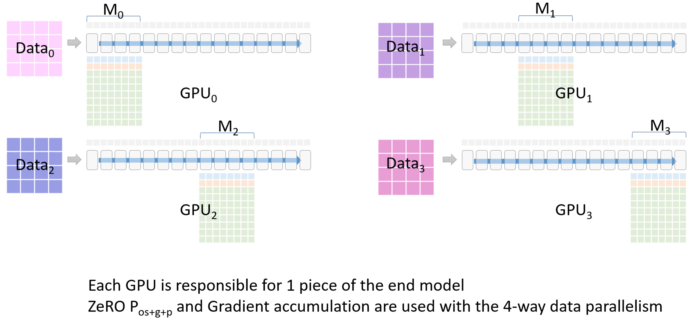
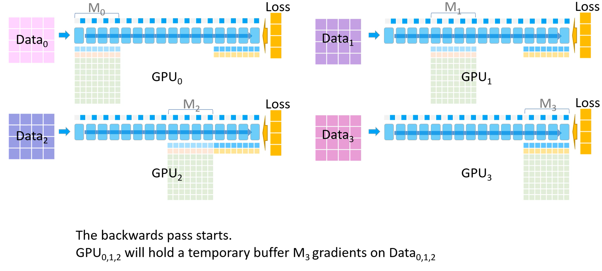
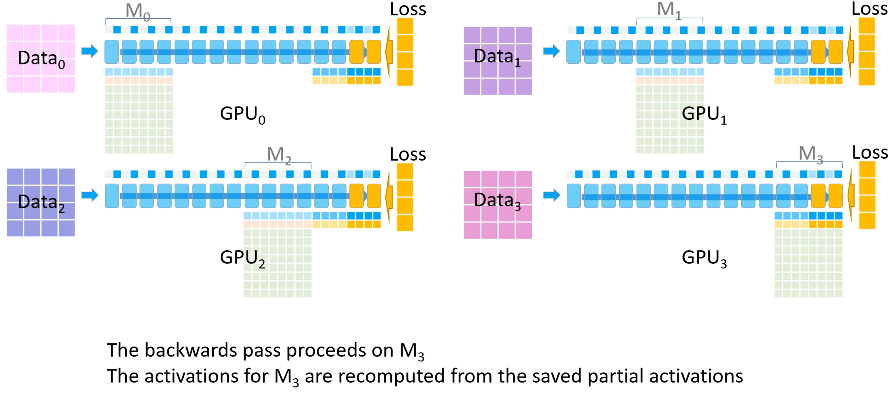

# 简介
DeepSpeed是微软推出的大模型分布式训练的工具，主要实现了ZeRO并行训练算法。

ZeRO（零冗余优化器，Zero Redundancy Optimizer）主要从模型参数（Parameters）、优化器状态（Optimizer States）和梯度（Gradients）三个方面对模型进行拆分，从而降低大模型训练占用的显存。
# ZeRO的三个级别

ZeRO被分为了三个级别：
1. ZeRO1：对优化器状态进行拆分；
2. ZeRO2：在ZeRO1的基础上，对梯度进行拆分。
3. ZeRO3：在ZeRO2的基础上，对模型参数进行拆分。
## ZeRO1
在模型训练中，正向传播和反向传播并不会用到优化器状态，只有在梯度更新的时候才会使用梯度和优化器状态计算新参数。

假设有$N_d$个并行的进程，ZeRO1会将完整优化器的状态等分成$N_d$份并存储在各个进程中。当反向传播完成之后，每个进程的优化器会对自己储存的优化器状态（包括Momentum、Variance 与 FP32 Master Parameters）进行计算与更新。更新过后的Partitioned FP32 Master Parameters会通过All-gather传回到各个进程中。完成一次完整的参数更新。

通过 ZeRO1 对优化器状态的分段化储存，7.5B 参数量的模型内存占用将由原始数据并行下的 120GB 缩减到 31.4GB。
## ZeRO2
第二阶段中对梯度进行了拆分，在一个 Layer 的梯度都被计算出来后：梯度通过 All-reduce 进行聚合，聚合后的梯度只会被某一个进程用来更新参数，因此其它进程上的这段梯度不再被需要，可以立马释放掉。

通过 ZeRO2 对梯度和优化器状态的分段化储存，7.5B 参数量的模型内存占用将由 ZeRO1 中 31.4GB 进一步下降到 16.6GB。

## ZeRO3
第三阶段就是对模型参数进行分割。在 ZeRO3 中，模型的每一层都被切片，每个进程存储权重张量的一部分。在前向和后向传播过程中（每个进程仍然看到不同的微批次数据），不同的进程交换它们所拥有的部分（按需进行参数通信），并计算激活函数和梯度。

初始化的时候。ZeRO3 将一个模型中每个子层中的参数分片放到不同进程中，训练过程中，每个进程进行正常的正向/反向传播，然后通过 All-gather 进行汇总，构建成完整的模型。

# ZeRO3过程图解
1. 首先我们有一个16个Transformer块构成的模型，每一个块都是一个Transformer块。

2. 有一个很大的数据集和四个GPU。

3. 使用ZeRO3策略，将OPG和数据都进行拆分放在四张卡上。

4. 每个模块下的格子代表模块占用的显存。第一行是FP16版本的模型权重参数，第二行是FP16的梯度，用来反向传播时更新权重，剩下的大部分绿色部分是优化器使用的显存部分，包含（FP32梯度，FP32方差，FP32动量，FP32参数）它只有在FP16梯度计算后才会被使用。ZeRO3使用了混合精度，因此前向传播中使用了半精度的参数。

5. 每个模块还需要一部分空间用于存放激活值，也就是上面蓝色的部分。

6. 每个GPU都会负责模型的一部分，也就是图中的$M_0$到$M_3$。

7. 现在正式进入ZeRO3的一个分布式训练流程：
- 首先，$GPU_0$将自身已经有的模型部分权重$M_0$通过broadcast发送到其他GPU。

- 当所有GPU都有了权重$M_0$
后，除了$GPU_0$以外的GPU会将他们存储在一个临时缓存中。
- 进行前向传播，每个GPU都会使用的参数在自己的进程的数据上进行前向传播，只有每个层的激活值会被保留。
- $M_0$计算完成后，其他GPU删除这部分的模型参数。

- 接下来，$GPU_1$将自己的模型权重参数$M_1$广播发送到其他GPU。所有GPU上使用进行前向传播。
- $M_1$计算完成后，其他GPU删除这部分的模型参数。
- 依次类推，将每个GPU上的各自的模型权重都训练完。
- 前向传播结束后，每个GPU都根据自己数据集计算一个损失。

- 开始反向传播。首先所有GPU都会拿到最后一个模型分块（也就是$M_3$）的损失。反向传播会在这块模型上进行，$M_3$的激活值会从保存好的激活值上进行计算。

- 其他GPU将自己计算的$M_3$的梯度发送给$GPU_3$进行梯度累积，最后在$GPU_3$上更新并保存最终的$M_3$权重参数。

- 其他GPU删除临时存储的$M_3$权重参数和梯度，所有GPU都删除
$M_3$的激活值。
- $GPU_2$发送$M_2$参数到其他GPU，以便它们进行反向传播并计算梯度。
- 依次类推，直到每个GPU上自己部分的模型参数都更新完。
- 现在每个GPU都有自己的梯度了，开始计算参数更新。
- 优化器部分在每个GPU上开始并行。

- 优化器会生成FP32精度的模型权重，然后转换至FP16精度。

- FP16精度的权重成为了下一个迭代开始时的模型参数，至此一个训练迭代完成。