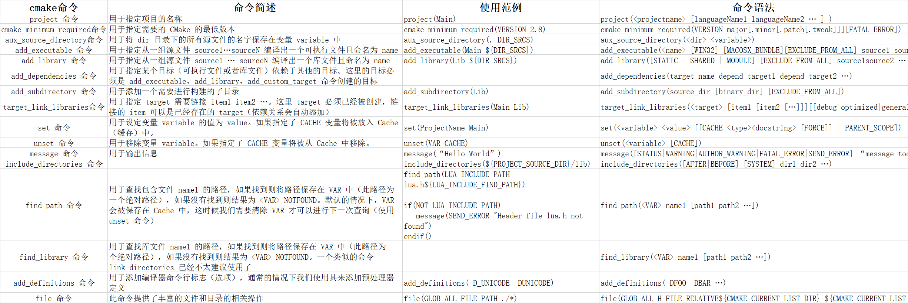

# CMake快速学习

## 只有一个源文件的程序编译
1. 首先在当前目录下创建两个文件，源文件`hello.cpp`和`cmake`文件`CMakeLists.txt`；
```shell
# cmake最低版本要求2.8
cmake_minimum_required (VERSION 2.8)
# 本项目的工程名
project (learn_cmake)
# 要生成的可执行文件名为hello，后面的参数是需要的依赖
add_executable(hello hello.cpp)
```
1. 接着在当前目录下执行`cmake .`；
2. 接着会发现目录下多生成了一些文件，例如Makefile等；
3. 然后使用`GNU make`来编译程序，即输入`make`命令；
4.  此时会发现已生成可执行程序，输入`./hello`就可以正常执行，
## 同一目录下多个源文件
此时在当前目录新增两个源文件，只需要在`CMakeLists.txt`中添加所依赖的`.cpp`文件如`add_executable(hello hello.cpp add.cpp)`，编译步骤和上面相同。
## 同一目录下很多源文件
三、同一目录下很多源文件
如果同一目录下有无穷多源文件，那么一个一个添加就很慢了。此时可以使用`cmake`中的函数存储这些源文件
`aux_source_directory(dir var)`，他的作用是把`dir`目录下的所有源文件都储存在`var`变量中，然后需要用到源文件的地方用变量`var`来取代，此时`CMakeLists.txt`可以这样优化:
```shell 
# 前面代码相同
aux_source_directory(. SRC_LIST) # `.`代表当前目录
add_executable(hello ${SRC_LIST}) 
# 变量的使用(引用)和Makefile不同，CMake是利用大括号，如 ${index}。
```
## 头文件在别的文件夹
对于集中的头文件，`CMake`提供了一个很方便的函数`include_directories (dir)`。它的作用是自动去`dir`目录下寻找头文件（该目录是在源文件基础上的相对路径），相当于`gcc`中的`gcc -I dir`，此时`CMakeLists.txt`可以这样优化。
```shell
#在./inc_dir目录下搜索所有头文件
include_directories (./inc_dir)
```
## 头文件源文件分离，并含有多个文件夹
假如说当前的项目目录是这样的：
1. ./inc_dir1和./inc_dir2目录下存放头文件
2. src_dir1和src_dir2目录下存放源文件
3. main_dir目录下存放生成的库
4. CMakeLists.txt存放在当前目录下，稍后也在当前目录下执行cmake和make。
那么CMakeLists.txt如下书写：
```shell
# 引入头文件路径
include_directories (./inc_dir1 ./inc_dir2)
# 获取某个人目录下的所有源文件
aux_source_directory(src_dir1 SRC_LIST1)
aux_source_directory(src_dir2 SRC_LIST2)
aux_source_directory(main_dir MAIN_DIR)
# 生成可执行文件
add_executable(hello ${SRC_LIST1} ${SRC_LIST2} ${MAIN_DIR}) 
```
## 生成动态库和静态库
### 项目目录
假如说当前的项目目录是这样的：
1. inc目录下存放头文件
2. src目录下存放源文件
3. lib目录下存放生成的库
4. build目录下存放构建项目相关的文件，如CMakeLists.txt。而稍后我们也在这个目录下执行cmake和make。
```shell
# 整合源文件
# PROJECT_BINARY_DIR是cmake系统变量，意思是执行cmake命令的目录
# dir1/../dir2 表示dir1的上级目录的子目录dir2
aux_source_directory(${PROJECT_BINARY_DIR}/../src SRC_LIST)

# 引入头文件目录
include_directories(${PROJECT_BINARY_DIR}/../inc)

# 生成静态库或动态库，参数一：生成的库的名称；参数二：静态或动态；参数三：生成所需要的源文件
add_library(func_shared SHARED ${SRC_LIST})
add_library(func_static STATIC ${SRC_LIST})

# 设置最终生成的库名称，这里把库名称统一为myfunc
set_target_properties(func_shared PROPERTIES OUTPUT NAME "myfunc")
set target properties(func_statiC PROPERTIES OUTPUT NAME "myfunc")

# 设置库默认生成到哪里
Set(LIBRARY_OUTPUT_PATH ${PROJECT_BINARY_DIR}/../lib)
```
## 七、链接库文件
我们已经在lib目录下生成了库文件，目录结构如下：
1. lib目录下存放静态库和动态库
2. main_src目录下存放main函数相关的源文件
3. bin目录存放项目生成的可执行文件
```shell
# 查找库(第三方库/系统库)，第一个参数：是一个变量，用于储存查找到的库文件；
# 第二个参数：要查找的库文件；第三个参数：要在那个目录下查找。
find_library(FUNC_LIB myfunC ${PROJECT_BINARY_DIR}/../lib)

# 设置可执行文件生成到哪里
Set(EXECUTABLE_OUTPUT_PATH ${PROJECT_BINARY_DIR}/../bin)

# 生成可执行文件
add_executable(hello ${MAIN SRC})

# 把库链接到可执行文件中
target_link_libraries(hello ${FUNC_LIB})
```
## CMake其他功能
### 添加编译选项
有时编译程序时想添加一些编译选项，如-Wall，-std=c++11等，可以使用add_compile_options来进行操作，例如
``` shell
# 在cmake中添加编译选项
add_compile_options(-std=c++11 -Wall -o2)
# -std=c++11 指定使用 C++11 标准。
# -Wall 开启大多数编译警告。
# -O2 设置编译器优化级别为2，这是一个常见的优化级别，用于提高生成代码的性能，同时保持合理的编译时间。
```